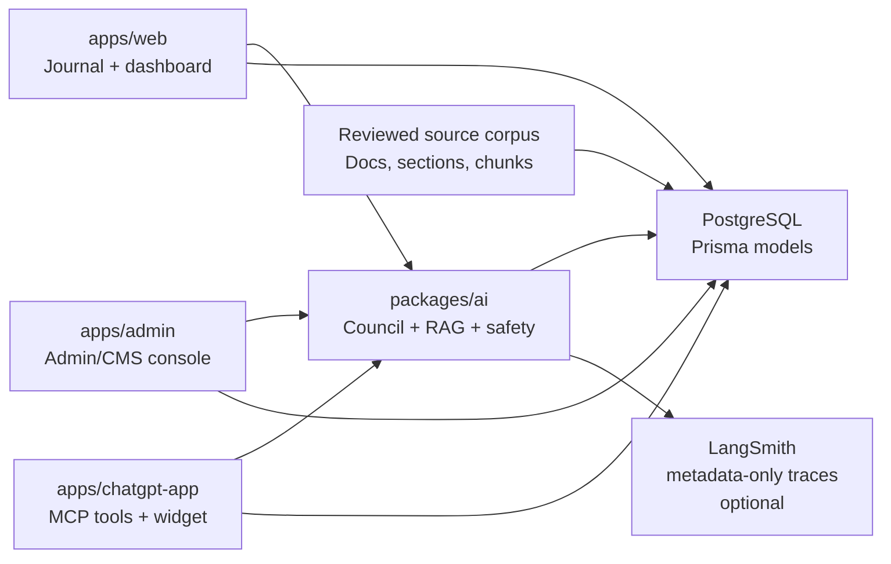

# Supraconscious Avatar AI

Supraconscious Avatar AI is a multi-app AI journaling platform for guided Inner Council reflection, source-grounded response generation, founder calibration, and administrative content governance.

The system combines a Next.js user app, a separate internal admin/CMS console, an Express-based ChatGPT/MCP server, PostgreSQL persistence, policy-first RAG, prompt governance, source provenance, LangSmith-ready observability, and Docker-ready deployment.

A Flutter mobile client is scaffolded under `apps/mobile` for future Apple App Store and Google Play release while keeping the existing backend, admin/CMS, and RAG governance surfaces as the system of record.

## Repository Details

**GitHub About / description**

Inner Avatar is a full-stack SaaS application that leverages AI-driven analysis to transform journaling into a structured reflection system, surfacing patterns, contradictions, and behavioral insights over time.

**Suggested topics**

`ai` `journaling` `reflection` `saas` `nextjs` `react` `typescript` `postgresql` `prisma` `openai` `rag` `vector-database` `mcp` `cms` `admin-dashboard` `docker` `kubernetes-ready`

## Technical Highlights

- **Agentic Inner Council flow**: journal input is classified, analyzed, routed through bounded council roles, synthesized into one integrator question, and saved with trace metadata.
- **Policy-first RAG**: approved source documents are parsed into documents, sections, and chunks; retrieval is gated by source state, rights metadata, quote permissions, safety intensity, feature flags, and trace validation.
- **Vector-DB-ready content model**: `SourceDocument`, `SourceSection`, and `SourceChunk` provide the provenance and chunk-review layer required for a future embeddings/vector search backend without bypassing review controls.
- **MCP integration**: `apps/chatgpt-app` exposes MCP-compatible tools, including `run_inner_council_reflection`, so external AI clients can call the same council pipeline used by the web app.
- **LangSmith observability**: optional metadata-only LangSmith tracing wraps the Inner Council service boundary, preserving hashed inputs, model/prompt versions, source ids, validation status, latency, and safe run metadata without exporting raw journal/source/prompt text.
- **LangGraph decision**: the current orchestrator remains a typed service pipeline; LangGraph is deferred until the product needs graph-native branching, resumable state, retries, or human-in-the-loop execution beyond the existing admin review workflows.
- **Admin as specialized CMS**: the admin app manages source review, prompt templates, feature flags, guide-stage metadata, RAG readiness, safety review, founder calibration, quality labels, users, and subscriptions.
- **Admin action feedback**: high-use CMS/review actions use server-action status banners, pending submit states, anchored redirects, and clearer local validation guidance.
- **Prompt calibration workflow**: admin-managed `PromptTemplate` records, generation traces, golden examples, and founder calibration reports support controlled prompt iteration.
- **Privacy-aware operations**: sensitive journal text is hidden from admin list views by default; review workflows use audit logs, metadata-first reports, scoped sessions, and explicit reveal paths.
- **Portable deployment path**: Vercel remains supported, while Dockerfiles and Compose provide a cloud-neutral runtime for web, admin, ChatGPT/MCP, and local Postgres testing.

## Workspace

- `apps/web`: Next.js journaling app, auth, onboarding, dashboard, journal flow, saved sessions, voice APIs, billing entry points, and user settings.
- `apps/admin`: separate Next.js internal admin/CMS console with its own login, session cookie, RBAC, review workflows, source governance, prompt management, and operational dashboards.
- `apps/chatgpt-app`: Express-based ChatGPT/MCP server, Inner Council MCP tool, compatibility tools, static widget, and container entrypoint.
- `apps/mobile`: Flutter client scaffold for iOS, Android, phones, and tablets.
- `packages/ai`: OpenAI adapters, safety checks, council orchestration, RAG retrieval policy, source provenance, prompt resolution, eval runners, calibration reports, and pattern-memory logic.
- `packages/db`: Prisma schema, generated client access, migrations, and shared database utilities.
- `packages/auth`: first-party auth, password hashing, scoped sessions, RBAC guards, and auth throttling.
- `packages/billing`: Stripe Checkout, Billing Portal, webhook helpers, and subscription sync.
- `packages/ui`: shared UI primitives.
- `packages/types`: shared TypeScript contracts.
- `packages/config`: shared TypeScript configuration.

## Architecture



The production-facing flow is intentionally service-boundary driven:

1. Web or MCP submits a reflection request.
2. Safety classification determines whether normal reflection can continue.
3. Structured journal analysis and optional retrieval context are generated.
4. Council roles produce bounded outputs.
5. The integrator synthesizes one question and an embodiment step.
6. Generation traces, source provenance, feedback, and review metadata are persisted.
7. Admin reviews content, prompts, source readiness, quality labels, and operational health.

When `LANGSMITH_TRACING=true` and a LangSmith key is configured, the Inner Council service also records an optional external trace. The exported payload is metadata-only by default: hashes, ids, timings, prompt/model versions, source provenance ids/titles, validation status, and selected safe counters. Raw journal text, feedback notes, prompt content, source chunk text, and full council output remain inside the application database.

## Admin / CMS Console

`apps/admin` can be described as a specialized internal CMS, but it is broader than a conventional page editor. It is the control plane for AI and content governance.

Current admin-owned surfaces include:

- source document, section, and chunk review
- RAG readiness and rollback controls
- prompt template management
- feature flag management
- guide-stage metadata
- user and subscription operations
- safety event review
- AI quality review
- founder calibration setup, live review, golden examples, and prompt/source issue queues
- health checks and operational status

Admin is deployed separately from the public app and uses a separate admin-scoped session cookie.

Admin mutations use Next.js server actions rather than Redux/Zustand. High-use review forms provide visible pending states, success/error status banners, and anchored redirects back to the affected source/session where practical.

## LangSmith And LangGraph

LangSmith support lives in `packages/ai/src/langsmith-observability.ts` and is disabled by default. To enable local metadata-only tracing:

```env
LANGSMITH_TRACING="true"
LANGSMITH_API_KEY="..."
LANGCHAIN_API_KEY="..."
LANGSMITH_PROJECT="inner-avatar-dev"
LANGCHAIN_PROJECT="inner-avatar-dev"
LANGSMITH_METADATA_ONLY="true"
```

`LANGSMITH_ENDPOINT` can stay blank for LangSmith Cloud. Set it only for custom or self-hosted deployments.

The implementation deliberately does not introduce LangGraph yet. The current council pipeline has a clear service boundary in `runCouncilReflection()` and already persists internal trace, review, and feedback state. LangGraph should be considered later if the app needs explicit graph state, resumable multi-step agent workflows, durable tool retries, or deeper human-in-the-loop branching.

## RAG And Vector Search

The current retrieval layer is policy-first and keyword based. This is intentional: source eligibility, rights, quote safety, safety intensity, review state, and traceability are enforced before retrieval quality is expanded.

The data model is prepared for vector search:

- reviewed source records are normalized into documents, sections, and chunks
- chunk-level approval and rights metadata are stored before retrieval
- retrieval traces persist selected chunk ids, match reasons, rank, validation status, and source mode
- downstream citation validation restricts outputs to selected chunks

Future embeddings or vector DB work should plug into `retrieveCouncilContext()` and preserve the same eligibility and trace contracts.

## MCP / ChatGPT App

`apps/chatgpt-app` exposes an MCP-compatible server with:

- `GET /health`
- `GET /mcp/tools`
- `POST /mcp/tools/:toolName`
- static widget assets under `/widget`

The primary tool is `run_inner_council_reflection`, which uses the same Inner Council service boundary as the web journal. Older analysis/avatar/prompt tools remain available as compatibility helpers.

Hosted tool execution should set `CHATGPT_APP_API_TOKEN`; health and tool metadata can remain public while execution requires a bearer token.

## Commands

Use the repository Yarn launcher. Do not use ambient Yarn 1.

```bash
node .yarn/releases/yarn-4.cjs install --immutable
node .yarn/releases/yarn-4.cjs db:generate

node .yarn/releases/yarn-4.cjs dev:web
node .yarn/releases/yarn-4.cjs dev:admin
node .yarn/releases/yarn-4.cjs dev:chatgpt
node .yarn/releases/yarn-4.cjs dev:founder-calibration

node .yarn/releases/yarn-4.cjs check:env
node .yarn/releases/yarn-4.cjs typecheck
node .yarn/releases/yarn-4.cjs lint
node .yarn/releases/yarn-4.cjs test:web
node .yarn/releases/yarn-4.cjs test:admin
node .yarn/releases/yarn-4.cjs test:ai
node .yarn/releases/yarn-4.cjs test:rag
node .yarn/releases/yarn-4.cjs test:langsmith
node .yarn/releases/yarn-4.cjs test:chatgpt

node .yarn/releases/yarn-4.cjs build:web
node .yarn/releases/yarn-4.cjs build:admin
node .yarn/releases/yarn-4.cjs build:chatgpt

node .yarn/releases/yarn-4.cjs mobile:check
node .yarn/releases/yarn-4.cjs mobile:doctor
node .yarn/releases/yarn-4.cjs mobile:analyze
node .yarn/releases/yarn-4.cjs mobile:test
node .yarn/releases/yarn-4.cjs mobile:build:android

node .yarn/releases/yarn-4.cjs verify:founder-calibration-code
node .yarn/releases/yarn-4.cjs verify:ci
```

`verify:founder-calibration-code` runs the full application code path used by CI. `verify:ci` adds Docker Compose validation and production image builds for web, admin, and ChatGPT/MCP.

## Docker

```bash
node .yarn/releases/yarn-4.cjs verify:docker
node .yarn/releases/yarn-4.cjs docker:build:web
node .yarn/releases/yarn-4.cjs docker:build:admin
node .yarn/releases/yarn-4.cjs docker:build:chatgpt
node .yarn/releases/yarn-4.cjs docker:compose:up
node .yarn/releases/yarn-4.cjs docker:compose:down
```

Compose includes:

- `postgres`
- `web` on port `3000`
- `admin` on port `3001`
- `chatgpt-app` on port `3002`
- one-shot schema setup services for local database preparation

Containers are designed to be stateless app instances. Session and application state live in Postgres, which keeps horizontal scaling viable once connection pooling is configured.

## Deployment

The current Vercel deployment uses the root `vercel.json` with the pinned Yarn 4 launcher and builds the web app from `apps/web`.

The repo also supports standalone Docker images for web, admin, and ChatGPT/MCP. Future Kubernetes deployment should use separate Deployments for each app, managed Postgres, Kubernetes Secrets, ingress routing, health probes, and database connection pooling before high replica counts.

## Documentation

- [Documentation Home](docs/README.md)
- [Architecture](docs/architecture.md)
- [AI Journaling Pipeline](docs/ai-pipeline.md)
- [Admin and Operations](docs/admin-and-operations.md)
- [ChatGPT MCP App](docs/chatgpt-mcp-app.md)
- [Container and Kubernetes Readiness](docs/container-and-kubernetes.md)
- [Flutter Mobile App](docs/mobile-flutter.md)
