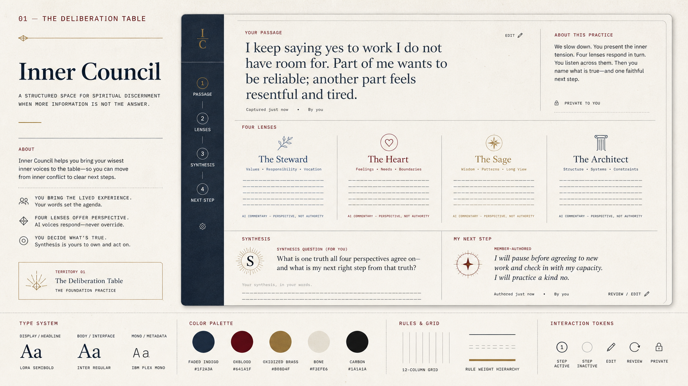
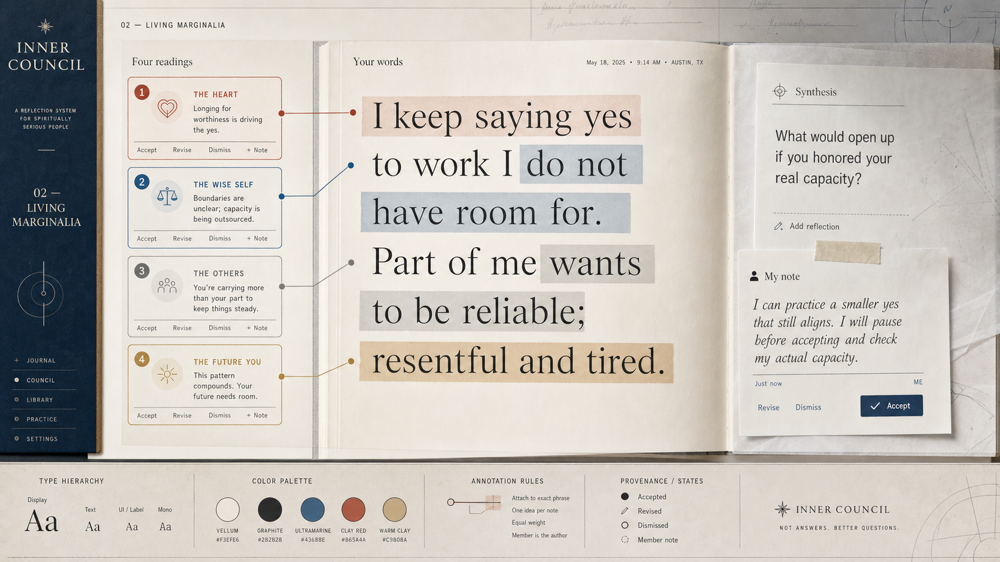
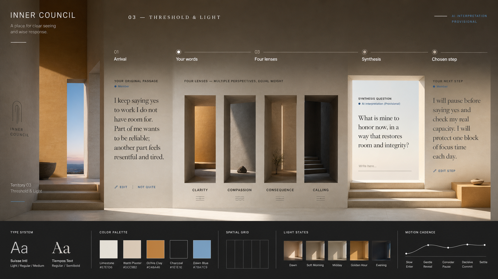
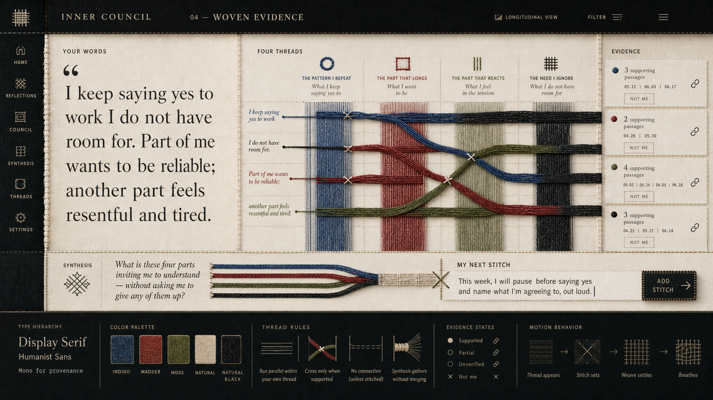
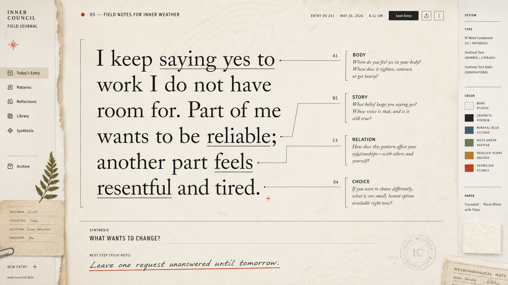
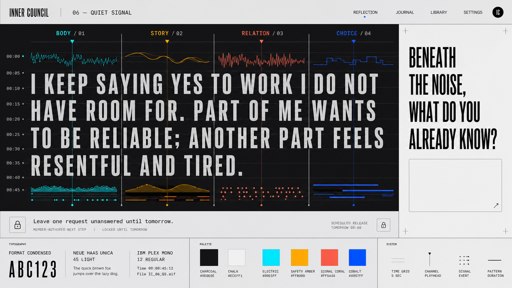
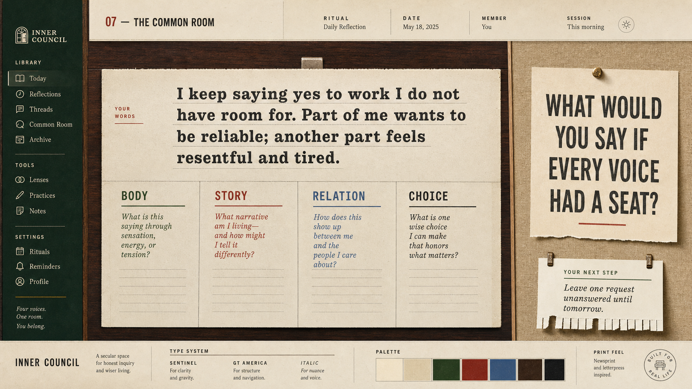
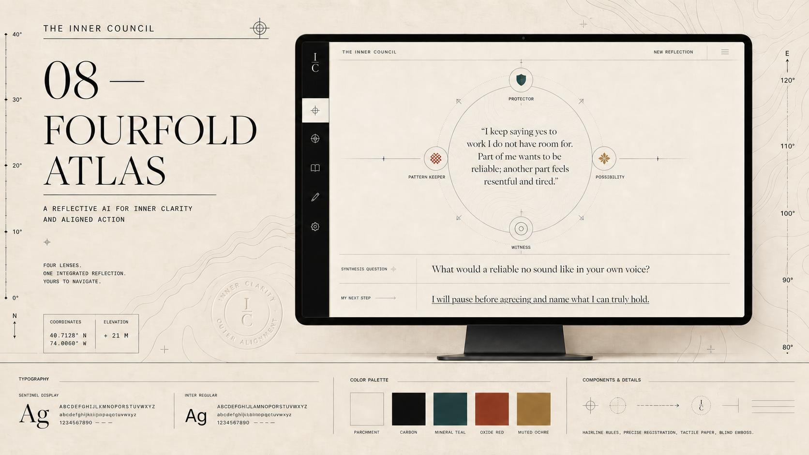
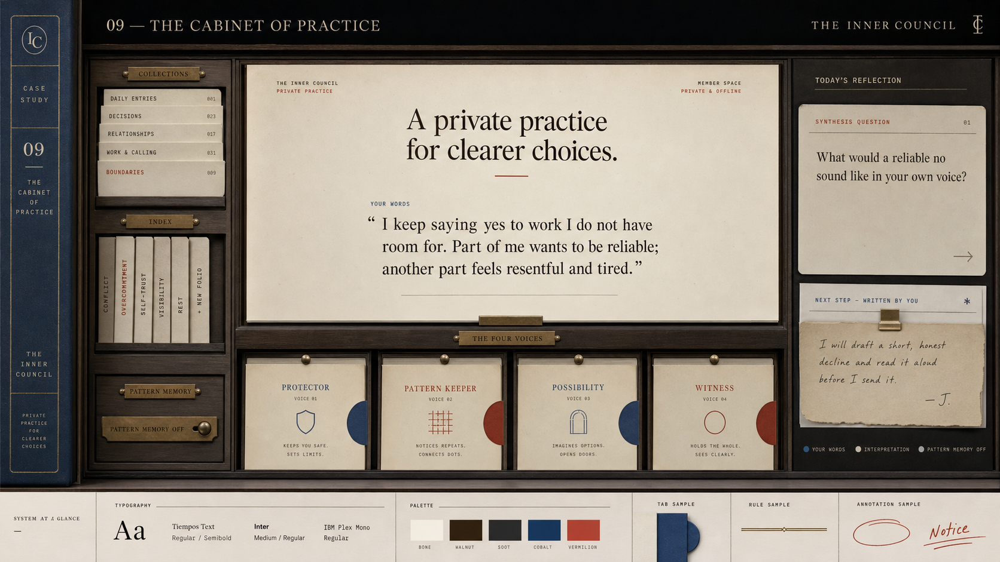
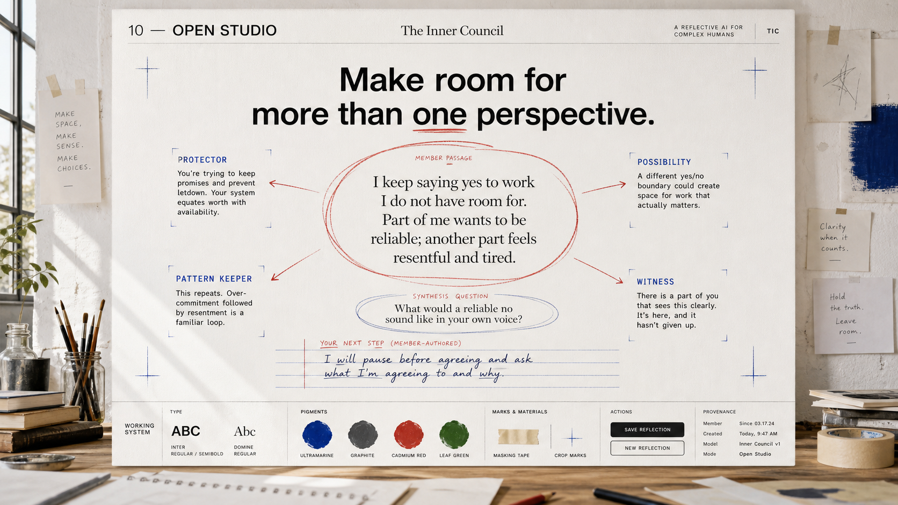

# Inner Council — Founder Visual Direction Review

Prepared July 24, 2026

These are ten product-native visual territories, not palette swaps. Every frame uses the same reflection ritual so the founder can compare the design system itself:

> Your words → four equal lenses → one open synthesis question → one member-authored step

Shared fictional passage:

> I keep saying yes to work I do not have room for. Part of me wants to be reliable; another part feels resentful and tired.

## Strategic shortlist

1. **The Deliberation Table** — strongest expression of a democratic council and the most direct fit with the product name.
2. **Living Marginalia** — strongest treatment of provenance, correction, and interpretive openness.
3. **Threshold & Light** — strongest premium emotional world and clearest spatial ritual.
4. **Open Studio** — bold challenger; most contemporary and visibly member-authored.

The recommended synthesis is **Deliberation Table structure + Living Marginalia provenance + Threshold & Light atmosphere**. Test that hybrid only after choosing a lead territory; do not average all ten together.

## The ten territories

### 01 — The Deliberation Table

Democratic editorial structure. Four voices receive equal weight; the member retains the deciding seat.

### 02 — Living Marginalia

The member's words are the primary text. AI interpretations remain attached, revisable annotations.

### 03 — Threshold & Light

A sequence of contemplative architectural rooms turns Write → Listen → Carry into spatial progression.

### 04 — Woven Evidence

Evidence-backed threads connect source phrases, perspectives, recurring signals, and chosen actions.

### 05 — Field Notes for Inner Weather

A naturalist's field journal for observing inner experience without diagnosing or scoring it.

### 06 — Quiet Signal

Cadence, pause, and resonance help distinguish a member's own signal from generated interpretation.

### 07 — The Common Room

A hospitable, lived-in space for serious reflection, with the member occupying the primary seat.

### 08 — Fourfold Atlas

Four maps of the same terrain orient the member without choosing the destination.

### 09 — The Cabinet of Practice

Reflection produces a small, editable practice the member can keep, revise, retire, or revisit.

### 10 — Open Studio

Interpretations are proposals on a working wall; the member revises and authors what carries forward.

## Founder critique questions

1. Does the direction make the actual method clearer or only more atmospheric?
2. Can the member see where their words end and the system's interpretation begins?
3. Do all four perspectives feel equal and non-authoritarian?
4. Is the member visibly the author of the final step?
5. Can this grammar extend credibly to landing, pricing, settings, errors, and mobile?
6. Does it feel spiritually serious without performing mysticism?

## Non-negotiable guardrails

- No oracle, guru, diagnosis, or supernatural certainty.
- No cosmic-eye, tarot, purple-gradient, or sacred-geometry shorthand.
- No generic SaaS card grid with spiritual labels.
- No streaks, badges, spiritual levels, or confidence percentages.
- Provenance, correction, optional memory, and user authorship stay visible.
- Pricing describes the member's practice and only promises implemented entitlements.

## Next decision

Choose three finalists. For each finalist, produce matched high-fidelity prototypes for:

1. landing hero plus one-reflection demonstration;
2. complete Write → Listen → Carry session;
3. pricing and trust;
4. mobile reflection result.

Do not reskin the whole application before this comparison is tested with the founder and representative members.
