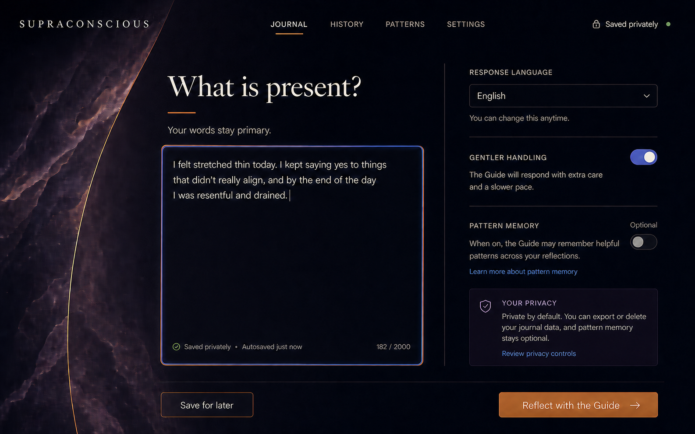
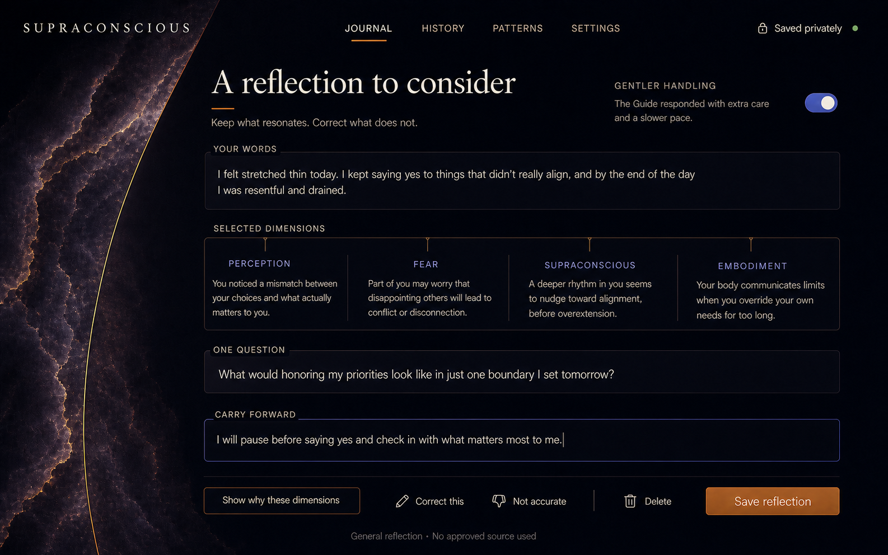
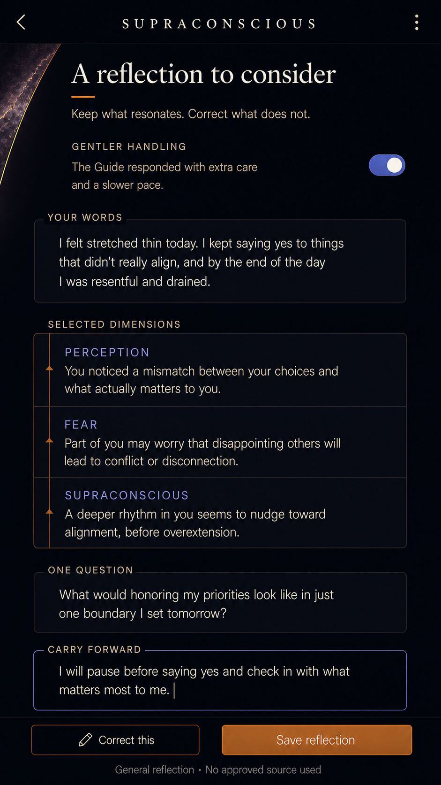

# Quiet Observatory × Inner Cosmos Synthesis

Prepared August 9, 2026 for Asana DES-001.

This exploration combines the structure and trust posture of **The Quiet Observatory** with the warmth and material depth of **Inner Cosmos, Matured**. It is a design direction, not a production reskin.

## Review surfaces

### 01 — Journal composer

The member's text is the primary object. Response language, gentler handling, optional pattern memory, autosave state, and privacy controls remain visible without competing with the writing task.

### 02 — Completed reflection

The result separates member evidence, equal selected dimensions, one open question, an editable member-authored action, correction controls, and source mode. The four dimensions shown are a variable selection, not a fixed ritual or hierarchy.

### 03 — Mobile reflection

The mobile translation preserves evidence and correction before compressing decoration. A sticky action region keeps correction and saving reachable while the result remains scrollable.

## Design-system thesis

### Structure from Quiet Observatory

- Editorial hierarchy instead of a generic dashboard grid.
- Fine observational rules and connectors that clarify relationships without implying ranking.
- Deep ink surfaces with high-contrast warm text.
- Copper for action and provenance; cobalt/lilac only for selection and focus.
- Generous negative space that makes reflection feel unhurried.

### Materiality from Inner Cosmos, Matured

- Mineral aubergine texture provides warmth and emotional depth.
- Texture stays at the atmospheric boundary and never sits behind reading text.
- Softly burnished edges replace literal planets, star fields, sacred geometry, or mystical shorthand.
- Warm parchment typography prevents the dark theme from feeling clinical or technological.

## Product and AI interaction rules

- The Guide remains one constant presence; no council personas or fixed roles return.
- Selected dimensions are equal, non-hierarchical facets and may vary by session.
- The member's words remain visually distinct from generated interpretation.
- Interpretation stays tentative: keep, correct, reject, or delete it.
- The member authors `Carry forward`; the system does not silently choose an action.
- Source mode is visible. Source-free output does not imply founder attribution.
- No confidence percentages or hidden chain-of-thought are presented.
- Pattern memory remains optional and separately controllable.
- Privacy copy must describe implemented controls only. The concepts intentionally make no encryption or model-training promises.

## Proposed semantic tokens

| Role | Direction |
|---|---|
| `canvas` | near-black navy |
| `surface` | ink with a slight aubergine cast |
| `surface-raised` | mineral plum at restrained opacity |
| `text-primary` | warm ivory |
| `text-secondary` | parchment gray |
| `border-subtle` | warm gray at low contrast |
| `border-active` | cobalt core with a copper outer edge |
| `action-primary` | burnished copper |
| `signal-selection` | muted cobalt/lilac |
| `signal-success` | quiet moss green |
| `danger` | restrained oxide red, reserved for destructive actions |

Typography should use an editorial serif only for page titles and questions. Navigation, controls, body copy, labels, metadata, and generated observations should use a highly legible sans serif.

## State inventory for implementation

The production design ticket must cover:

- composer: empty, focused, autosaving, saved, validation error, offline/retry, and permission denied;
- reflection: processing, ready, gentle handling, plain-grounding safety exit, recoverable generation failure, and partial save;
- correction: edit, reject, restore, and confirmation states;
- pattern memory: on, off, unavailable, and pending deletion;
- provenance: approved source, general reflection, no eligible source, and grounding;
- destructive actions: explicit confirmation, success, and failure recovery;
- responsive layouts at 320, 375, 390, 430, 768, 1024, and 1440 pixels;
- reduced motion, keyboard order, visible focus, screen-reader labels, and contrast verification.

## Implementation implications

1. Tokenize the direction before changing page-level styling. Avoid layering another stylesheet over existing arbitrary values.
2. Build shared `EvidenceBlock`, `DimensionFacet`, `ProvenanceLine`, `CorrectionActions`, and `MemberActionEditor` patterns.
3. Treat mineral artwork as a responsive decorative asset with `aria-hidden`, reduced-motion behavior, and strict text-safe zones.
4. Preserve current authorization, privacy, safety, and owner-scoping behavior. Visual redesign must not weaken product boundaries.
5. Use real HTML text and controls. These raster concepts are visual references, not exact production copy or accessibility evidence.

## Validation plan

- Founder concept review: compare clarity, emotional fit, and trust against Directions 01 and 04 separately.
- Five-task usability pass: begin a reflection, enable gentler handling, identify generated versus authored content, correct an observation, and save or delete the result.
- Accessibility pass: keyboard-only, screen reader, 200% zoom, contrast, reduced motion, and touch targets.
- Responsive screenshot set for composer and result states.
- Instrument entry-to-submit completion, correction use, result save/delete, provenance expansion, and pattern-memory changes without recording journal content.

## Generation notes

The three mockups were generated with built-in Codex ImageGen using the selected Direction 01 and Direction 04 concepts as visual references. Prompts required the current doctrine boundary, equal variable dimensions, visible provenance and correction, member authorship, readable UI, and explicit avoidance of unsupported privacy claims and mystical authority.

The first composer draft included unsupported encryption/model-training language. It was rejected and regenerated with repository-grounded privacy copy before inclusion here.
