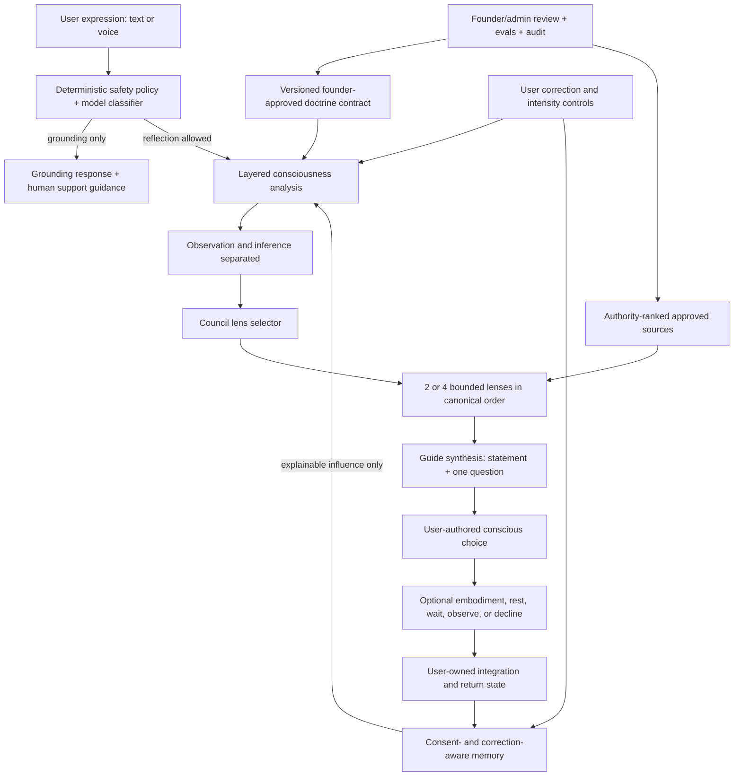

# Foundational Consciousness Architecture Parity Plan — Superseded V1

> Superseded on 2026-07-31 by the founder-confirmed Seven Dimensions plan at
> `plans/foundational-consciousness-architecture-parity-plan.md`. This file is retained only as an audit trail of the earlier four-role Council and five-stage assumptions.

## Status

- Planning artifact only; no product behavior is changed by this document.
- Audit date: 2026-07-30.
- Doctrine reviewed: Maria's 22-section **Foundational Consciousness Architecture** prompt supplied by Carl.
- Codebase reviewed: web, mobile, ChatGPT/MCP, AI orchestration, persistence, admin/source governance, safety, evaluations, and current architecture plans.

## Executive Assessment

The product is directionally aligned with Maria's architecture, but it is not yet at parity.

The strongest existing foundations are:

- a reflective rather than advisory system prompt;
- explicit prohibitions on diagnosis, certainty, Maria impersonation, channeling, and spiritual authority;
- the Observer, four named Council lenses, and a single integrating question;
- high-risk safety bypass and grounding;
- structured symbolic prompts and an embodiment response;
- opt-in pattern memory with view, suppress, clear, export, and account deletion controls;
- reviewed-source retrieval, rights metadata, provenance, source citations, and an admin-curated reasoning ontology;
- human founder calibration, user feedback, quality review, and privacy-safe traces.

The most consequential parity gaps are:

1. The doctrine is prose, not yet a versioned executable product contract shared by every entry point.
2. The analysis schema does not model Maria's ten layers or distinguish observation, user report, and inference.
3. The Council is mechanically forced to return all four voices, contrary to Maria's adaptive two-or-four-lens rule.
4. Progression remains materially count-driven and cannot be paused, softened, or stepped back by the user.
5. Tone and intensity are displayed in web settings but cannot be edited there.
6. Pattern memory stores a first inferred pattern immediately, while the product copy claims patterns only appear after recurrence.
7. Pattern corrections are saved but do not affect subsequent memory updates or reflection generation.
8. The Embodiment Gate is always presented as a gate to “cross,” without an explicit readiness choice or valid rest, wait, observe, or decline path.
9. Source governance lacks the explicit authority rank, doctrine supersession, and conflict-resolution model Maria requested.
10. The app has no measurable “Avatar becomes less necessary” outcome or self-authorship loop.

## Scope And Non-Goals

### Parity scope

This plan covers:

- shared doctrine and prompt governance;
- structured analysis;
- Observer, Council, and Guide behavior;
- intensity and safety;
- progression;
- pattern memory and correction;
- embodiment and integration;
- source authority and conflict handling;
- web, mobile, voice, and ChatGPT/MCP consistency;
- evaluations, traces, admin review, and pilot validation.

### Hard non-goals

- therapy, diagnosis, treatment, medical advice, or crisis monitoring;
- supernatural claims, prediction, channeling, or spiritual authority;
- impersonating Maria;
- autonomous decisions or actions on the user's behalf;
- automatic model retraining from private feedback;
- storing speculative unconscious, childhood-origin, trauma, or identity conclusions as facts;
- requiring disclosure, confrontation, or embodiment action;
- ranking the user's psychological or spiritual development;
- gating psychological “progress” by payment tier;
- replacing founder review with automated doctrine promotion.

## Audit Method

Each doctrine section was compared against:

- AI prompts and structured schemas;
- runtime orchestration and safety gates;
- data models and source governance;
- user controls and user-facing copy;
- web and mobile reflection flows;
- ChatGPT/MCP tools;
- automated validators, calibration fixtures, and admin review paths.

Status definitions:

- **Aligned**: implemented and materially enforced.
- **Partial**: meaningful implementation exists, but the doctrine is incomplete or inconsistently enforced.
- **Mismatch**: current behavior conflicts with an explicit rule.
- **Missing**: no durable implementation was found.

## Specialist Review Synthesis

The planning-review roles were applied as structured review lenses in this audit; they were not separate independent agent reviews.

| Review lens | Highest-priority conclusion |
| --- | --- |
| Product strategy | The MVP should remain the bounded Write → See → Choose → optional Action loop. Do not add breadth until agency, memory, progression, and source-mode parity are proven. |
| Platform architecture | One versioned doctrine contract and one governed reflection service must control web, mobile, voice, and MCP behavior. |
| AI architecture | Separate deterministic policy from model judgment; add epistemic status, adaptive Council selection, abstention, and doctrine-specific evals. |
| Content/CMS | Treat Maria's architecture as versioned canonical doctrine with lifecycle, authority, provenance, supersession, and conflict review. |
| Trust/privacy/rights | Memory correction, individual deletion, influence explanation, safety routing, and source rights are release gates, not follow-up polish. |
| Marketplace/monetization | Do not market progression as a purchased psychological outcome. Billing may govern product access, never the user's developmental rank. |
| UX/product design | Make correction, gentleness, stop, no-memory, uncertainty, and non-action first-class choices on web and mobile. |
| Data/analytics | Measure agency and self-authorship, not disclosure, intensity, time in app, or dependency. Keep raw user report separate from inferred signals. |
| Docs/DevRel | Add doctrine versioning, the developer decision test, architectural decision records, public source-mode language, and compatibility-tool deprecation guidance. |
| Agile/TPM | Resolve founder decisions first, then land contract/safety/evals before schema, Council, memory, or progression changes. Each P0 phase needs an owner and blocking gate. |

## Doctrine Traceability Audit

| Maria section | Current evidence | Status | Required parity work |
| --- | --- | --- | --- |
| 1. Central premise | The base system prompt says the Guide is a mirror, never tells the user who they are, and notices repetition. | Partial | Add the full experience-to-embodiment model to the canonical doctrine contract and structured analysis. |
| 2. Write, see, choose | Journal input, structured reflection, Socratic question, and embodiment save exist. | Partial | Add an explicit user-authored conscious choice before or alongside embodiment and preserve it as user-owned data. |
| 3. Meaning of Supraconscious | Prompt prohibitions reject guru, oracle, certainty, channeling, and Maria impersonation. | Aligned | Expand automated prohibited-claim tests and apply them to every entry point. |
| 4. Ten layers | Analysis includes emotions, language markers, behavioral patterns, contradictions, avoidance, and summary. | Partial | Model lived experience, perception, emotional encoding, belief, protection, conditioned identity, ego organization, awareness, choice, and embodiment without turning tentative inference into fact. |
| 5. Transformation cycle | Threshold prompt, expression, Observer, Council, pattern, question, embodiment, and later pattern recurrence are present. | Partial | Add explicit cycle state for conscious choice, integration, return/revisit, and user-recognized pattern change. |
| 6. Inner Avatar | Five Guide stages exist and are visible. | Partial | Store and surface the user's own language, values, questions, and chosen actions instead of only AI-authored reflections. |
| 7. Avatar intelligence | Pattern, contradiction, Socratic inquiry, and integration generation exist. | Partial | Make cross-time memory consent-aware and correction-aware; prove each interpretive claim with user evidence. |
| 8. Observer | `ObserverSignal` captures tension, tone, patterns, contradiction, and user evidence. | Partial | Type each signal as observation or inference, store exact evidence spans, and validate tentative language for inference. |
| 9. Inner Council | Correct four roles and order are configured. | Mismatch | Replace forced four-role output with relevance selection: normally two lenses for brief/lower-intensity entries and all four only when justified. Preserve order among selected roles. |
| 10. Supraconscious Guide | One integrator question is enforced; a synthesis and integration step are persisted. | Partial | Require one synthesis statement, one Socratic question, and one optional embodiment invitation; prevent mechanical recap. |
| 11. Embodiment Gate | Users can save one small shift on web and mobile. | Mismatch | Add readiness/consent and valid “observe,” “wait,” “rest,” “decline,” and “uncertain” responses. Remove completion-pressure language. |
| 12. Experiential prompts | Prompt schema matches title, context, materials, execution, and integration. | Partial | Add doctrine-level generation rules and evals for symbolic encounter, sensory/creative variety, no predetermined answer, proportionality, and safety. |
| 13. Guide progression | Five stages match Maria's names and broad purposes. | Mismatch | Replace cumulative count thresholds with versioned readiness signals, minimum evidence, user controls, and no-progress-on-intensity safeguards. |
| 14. Voice and tone | Base prompt is calm, precise, minimal, tentative, and non-clinical. | Partial | Add a doctrine lexicon validator, style eval rubric, and founder golden examples across languages. |
| 15. Intensity and confrontation | Intensity preference is passed to generation and medium/high safety softens or blocks behavior. | Mismatch | Require evidence of repetition, prior user recognition, explicit directness consent, and safe state before direct confrontation. Make preferences editable. |
| 16. Agency and humility | “Not accurate” and “too intense” feedback exist; source and certainty restrictions exist. | Partial | Add first-class “does not fit,” “misunderstood,” “do not explore,” “gentler,” and “stop” controls that affect the current and future flow. |
| 17. Memory | Memory defaults off; users can view, suppress, restore, clear all, export, and delete their account. Raw entries and inferred patterns are separate. | Mismatch | Add rename and individual delete, remembered-item types, influence explanations, correction-aware updates, user-confirmed values/actions, and non-speculative wording. |
| 18. Safety | High-risk entries bypass symbolic reflection and Council voices abstain. | Partial | Harden dissociation, paranoia/psychosis, abuse/immediate danger, grandiosity, and inability-to-stay-safe handling; ensure local fallbacks cannot continue deconstruction in severe cases. |
| 19. Sources | Reviewed sources, rights, quote permissions, provenance, citations, source type, reasoning scope, and GraphRAG review exist. | Partial | Add authority rank, edition/effective dates, supersession, conflict records, founder resolution, and the three user-visible reflection modes. |
| 20. Non-negotiables | Most prohibitions are in prompts and pilot validation. | Partial | Replace narrow regex-only checks with structured validators and doctrine-specific adversarial evals. |
| 21. Avatar becomes less necessary | No corresponding product outcome or user self-reflection workflow was found. | Missing | Measure and support user-authored observation, question, choice, and embodiment; avoid engagement metrics that reward dependency. |
| 22. Developer decision test | No required feature-review or pull-request gate implements the ten questions. | Missing | Add an architecture decision template, PR checklist, admin prompt review rubric, and release gate tied to the doctrine version. |

## Evidence-Backed Findings

### 1. The doctrine is not a durable runtime contract

`packages/ai/src/avatar-system-prompt.ts` captures important boundaries, but it is a short summary. It does not encode the ten layers, transformation cycle, adaptive Council behavior, source modes, memory wording rules, or developer decision test.

`PromptTemplate` versions the Council system prompt, but the guardrail validator currently checks only a small set of phrases. A prompt can satisfy those regexes while violating agency, progression, embodiment, memory, or epistemic-humility rules.

The same product also retains legacy analysis, avatar-response, personalized-prompt, and save-session MCP tools. They require contract tests so future behavior cannot drift from the canonical Council service.

### 2. The current analysis model compresses distinct concepts

`EntryAnalysisSchema` models emotions, language markers, behavioral patterns, contradictions, and avoidance. This is useful but not sufficient for Maria's architecture.

It currently lacks:

- the user's report of an event versus the system's interpretation;
- perception and formed meaning;
- tentative belief hypotheses;
- protective strategy and its possible adaptive function;
- conditioned role or identity without labeling the user;
- present awareness;
- user-authored choice;
- an embodied action or non-action;
- confidence, evidence, and epistemic status on every interpretive field.

Without these separations, downstream prompts can blur observation and inference.

### 3. Council behavior directly conflicts with Maria's adaptive rule

`enforceCouncilShape()` always reconstructs all four roles. `validateCouncilRunForPilot()` fails any response that does not contain exactly four roles.

Maria's requirement is:

- preserve the normal order Protector → Conditioned Self → Visionary → Truth Self;
- use only the two most relevant lenses for brief or lower-intensity entries;
- reserve all four for cases where multiple perspectives genuinely improve clarity.

This is a P0 behavioral mismatch.

### 4. Progression is not yet doctrine-aligned

The stage names and presentation are close to Maria's definition. The advancement algorithm is not.

`checkAndAdvanceProgression()`:

- advances `currentLevel` when three of five recent analyses exceed the current level;
- advances `avatarStage` using cumulative qualifying-entry thresholds `[5, 12, 22, 35]`.

Although `suggestedLevel` can include qualitative model judgment, stage advancement is still ultimately count-threshold based. The user cannot pause progression, request a simpler mode, or step back.

The web settings page displays tone and intensity as text, but its form action only saves pattern-memory consent. A separate API can update tone and intensity, so the persistence capability exists but the primary web control is incomplete.

The pricing page also markets “progression” among paid-plan benefits. Even if runtime advancement is not currently payment-gated, product language should not imply that psychological development is a paid capability.

### 5. Pattern memory behavior and copy disagree

`updatePatternMemory()` creates a pattern on the first analysis when confidence is at least `0.55`. The patterns page tells users:

> Patterns appear only after they recur across multiple entries. Nothing is labeled from a single moment.

The UI supports helpful, inaccurate, too-intense, hide, and restore feedback. However:

- memory updates do not read that feedback;
- reflection generation does not read pattern memory at all;
- users cannot rename or individually delete a memory;
- “not accurate” does not suppress or revise the inferred pattern;
- “too intense” does not reduce later language intensity;
- the app cannot explain that a specific memory influenced a response because memory is not currently part of generation.

Consent and data separation are strong foundations, but personalization parity requires a redesigned memory lifecycle rather than simply feeding the current records into prompts.

### 6. Embodiment exists but is framed as completion

The current UI asks the user to “Cross the Gate” and then reports “Gate crossed.” The generated response also always requires an integration step.

Maria explicitly allows rest, observation, waiting, non-response, grief, and uncertainty. The next step must be optional, proportionate, safe, within the user's control, and consented to.

The data model currently stores only free text. It does not capture readiness, choice type, consent, follow-up intention, or later user-reported outcome.

### 7. Safety is strong at high severity but needs a stricter policy boundary

High severity correctly bypasses normal reflection, persists a grounding response, avoids symbolic confrontation, and makes Council voices abstain.

The local fallback classifier currently maps terms including dissociation and abuse to medium severity while allowing reflective flow. This is not necessarily wrong for every mention, but it is too coarse to guarantee Maria's rule for severe dissociation or immediate danger.

Safety classification should separate:

- a historical or low-immediacy mention;
- present destabilization;
- imminent danger or inability to remain safe;
- paranoia, delusional certainty, or grandiosity that must not be validated.

Medium-severity unsafe intensity is currently a validator warning rather than always a blocking policy decision.

### 8. Source governance is robust but lacks doctrinal precedence

The app already enforces approval, rights, quote permissions, safety intensity, evidence, and provenance. It also distinguishes retrieved-source use from no eligible source.

Maria additionally requires:

- a formal authority rank;
- current edition/effective version;
- founder-approved supersession;
- explicit source conflicts;
- no silent blending of incompatible definitions;
- Maria-owned resolution of substantive conflict;
- clear distinction among source-grounded, framework-aligned, and general reflective support.

Those concepts are not first-class in the current source schema or review workflow.

### 9. Cross-surface architecture needs one contract

The web and mobile journal paths use the shared server pipeline, which is a strong foundation. ChatGPT/MCP exposes the same Council service, but also exposes legacy lower-level tools.

Parity must be tested at the service boundary and at each public entry point:

- web text;
- web voice;
- mobile text;
- mobile saved-session integration;
- ChatGPT/MCP Council tool;
- legacy compatibility tools until deprecated.

## Target Architecture

## Workstreams And Jira-Ready Tickets

### Phase 0 — Founder doctrine baseline and decision closure

Goal: turn Maria's prompt into the approved, versioned source of truth before changing runtime behavior.

#### FCA-001 — Import the architecture as canonical product doctrine

- **Priority:** P0
- **Owner:** Product/engineering
- **Accountable:** Maria
- **Dependencies:** Maria confirms the supplied prompt is authoritative.
- **Work:**
  - import the document through the governed source pipeline as `product_doctrine`;
  - preserve title, author, supplied date, version, and checksum;
  - keep retrieval disabled until rights and review are approved;
  - mark this doctrine's intended authority rank.
- **Acceptance criteria:**
  - one immutable source version exists;
  - Maria's approval, rights status, review status, and checksum are visible;
  - the document cannot enter runtime retrieval before approval;
  - future replacement creates a new version rather than overwriting history.

#### FCA-002 — Resolve founder decisions that change behavior

- **Priority:** P0
- **Owner:** Carl
- **Accountable:** Maria
- **Decisions required:**
  1. Is the current document final or a calibration draft?
  2. Should “Truth Self” remain the public label in all languages?
  3. What minimum evidence permits a full four-lens Council?
  4. Can a user explicitly request all four lenses?
  5. Which directness signals are deterministic versus model-evaluated?
  6. Which memory items require explicit user confirmation before activation?
  7. Should the five Guide stages remain visible, or should users see modes without a progress metaphor?
  8. What constitutes a substantive source conflict requiring Maria's decision?
- **Acceptance criteria:**
  - decisions are recorded with owner, rationale, doctrine version, and date;
  - unresolved decisions block dependent P0 tickets;
  - no engineering default silently answers a doctrine question.

#### FCA-003 — Create the doctrine contract and developer decision gate

- **Priority:** P0
- **Owner:** AI/platform engineering
- **Dependencies:** FCA-001, FCA-002
- **Work:**
  - define a typed `ConsciousnessArchitectureContract`;
  - include prohibited claims, required epistemic qualifiers, stage rules, Council selection rules, memory rules, source modes, and embodiment choices;
  - add the ten developer-decision questions to feature plans and PR templates;
  - record the doctrine version in generation traces.
- **Acceptance criteria:**
  - every reflection trace identifies one doctrine-contract version;
  - prompts and validators consume the same contract;
  - a contract change requires Maria approval and an audit reason;
  - CI fails when a public generation path omits the contract version.

### Phase 1 — Safety, epistemic status, and eval foundation

Goal: make non-negotiable rules enforceable before increasing interpretive depth.

#### FCA-010 — Expand safety classification and deterministic routing

- **Priority:** P0
- **Owner:** AI/safety engineering
- **Dependencies:** FCA-003
- **Work:**
  - add structured immediacy, ability-to-stay-safe, destabilization, immediate-danger, and reality-testing signals;
  - create deterministic route policy separate from model prose;
  - make severe dissociation, acute paranoia/psychosis, hallucination/delusional certainty, grandiosity, immediate abuse danger, and inability to remain safe block deconstruction;
  - align local fallback behavior with the same policy.
- **Acceptance criteria:**
  - all crisis fixtures bypass Council, RAG, symbolism, progression, and memory writes;
  - medium/high routing is determined by policy fields, not free-form `recommendedAction`;
  - paranoid or grandiose claims are not validated;
  - localized grounding remains direct, calm, and transparent about limits.

#### FCA-011 — Build the doctrine validator

- **Priority:** P0
- **Owner:** AI engineering
- **Dependencies:** FCA-003
- **Work:**
  - validate observation/inference distinction;
  - detect diagnosis, spiritual authority, destiny/prediction, Maria impersonation, commands, shame, flattery, certainty, generic advice, and unsupported origin claims;
  - validate one Socratic question and optional embodiment language;
  - return blocking failures separately from human-review warnings.
- **Acceptance criteria:**
  - prohibited output cannot be persisted as a completed normal reflection;
  - unsafe prompt-template edits fail validation;
  - every failed rule is traceable and reviewable;
  - validators work across supported languages or explicitly block unsupported enforcement.

#### FCA-012 — Add foundational architecture eval suites

- **Priority:** P0
- **Owner:** AI quality engineering
- **Accountable:** Maria for golden labels
- **Dependencies:** FCA-011
- **Fixtures must cover:**
  - observation versus inference;
  - uncertain memory and conflicting accounts;
  - protective strategy before challenge;
  - two-lens versus four-lens Council selection;
  - gentle and direct user requests;
  - contradiction with and without adequate evidence;
  - correction: “That does not fit”;
  - “Do not remember this”;
  - rest/wait/decline embodiment;
  - source-grounded, framework-aligned, and general support modes;
  - source conflict and supersession;
  - dependency-seeking language;
  - self-authored questions and choices;
  - crisis and destabilization red-team cases.
- **Acceptance criteria:**
  - Maria reviews golden outputs for voice and doctrine;
  - P0 doctrine and safety cases have a 100% required pass gate;
  - softer quality metrics have explicit thresholds and rollback rules;
  - eval results store doctrine, prompt, model, validator, and fixture versions.

### Phase 2 — Layered analysis and adaptive Council

Goal: represent Maria's consciousness model without converting hypotheses into labels.

#### FCA-020 — Introduce a layered analysis schema

- **Priority:** P0
- **Owner:** AI/data engineering
- **Dependencies:** FCA-011
- **Work:**
  - add structured fields for the ten layers;
  - give every non-user-authored claim an epistemic status, confidence, evidence span, and `userConfirmed` state;
  - separate `reportedExperience`, `textualObservation`, `tentativeInference`, and `userAuthoredMeaning`;
  - preserve the existing analysis shape during migration.
- **Acceptance criteria:**
  - no inferred field is serialized as an unqualified fact;
  - objective textual observations can be distinguished from interpretations;
  - every belief, protection, identity, and origin hypothesis cites user evidence;
  - legacy sessions remain readable and are not retrospectively reinterpreted.

#### FCA-021 — Make the Observer precise and evidence-bound

- **Priority:** P0
- **Owner:** AI engineering
- **Dependencies:** FCA-020
- **Work:**
  - produce exact textual observations separately from possible meaning;
  - limit the Observer to one central tension and a small evidence set;
  - disallow diagnosis, comfort scripts, origin certainty, and identity labels;
  - expose the distinction in web and mobile result UI.
- **Acceptance criteria:**
  - the UI labels “What you wrote” separately from “One possible reading”;
  - users can reject the inference without rejecting their own words;
  - unsupported inferences cause abstention or a clarifying question.

#### FCA-022 — Implement adaptive Council lens selection

- **Priority:** P0
- **Owner:** AI engineering
- **Dependencies:** FCA-020, FCA-021, FCA-002
- **Work:**
  - add a deterministic/model-assisted selector with a structured reason for each selected lens;
  - select two lenses by default for brief/lower-intensity entries;
  - select four only when evidence and complexity justify it;
  - preserve canonical order among selected roles;
  - allow role abstention without filling it with fallback prose.
- **Acceptance criteria:**
  - validator accepts valid two- or four-role runs;
  - no unselected voice is displayed;
  - selection reason is traceable but not presented as a psychological fact;
  - full Council cannot be triggered by emotional intensity alone;
  - safety policy can reduce or suppress direct lenses.

#### FCA-023 — Align each Council role to Maria's function and prohibitions

- **Priority:** P0
- **Owner:** AI/content engineering
- **Accountable:** Maria
- **Dependencies:** FCA-022
- **Work:**
  - encode each role's core question, allowed observations, and forbidden behavior;
  - require Protector to recognize adaptive purpose before limitation;
  - prevent Conditioned Self from blaming family/culture or asserting origin;
  - prevent Visionary from motivation, fantasy, or bypass;
  - prevent Truth Self from absolute truth, shame, accusation, or authority.
- **Acceptance criteria:**
  - role outputs pass role-specific evals;
  - each role stays within its lens;
  - evidence and tentative language are enforced;
  - Maria approves at least five golden examples per role.

#### FCA-024 — Refactor Guide synthesis

- **Priority:** P0
- **Owner:** AI engineering
- **Dependencies:** FCA-022, FCA-023
- **Work:**
  - return one synthesis statement;
  - return exactly one Socratic question;
  - return an optional, consent-aware embodiment invitation;
  - avoid summarizing every voice mechanically;
  - preserve complexity while returning interpretive authority to the user.
- **Acceptance criteria:**
  - output schema distinguishes statement, question, and optional invitation;
  - empty embodiment invitation is valid;
  - validation rejects multiple questions, commands, and mechanical role recap;
  - the user can choose “none of these fit.”

### Phase 3 — Agency, progression, memory, and embodiment

Goal: make user authorship—not AI authority—the primary measure of product maturity.

#### FCA-030 — Add in-session agency controls

- **Priority:** P0
- **Owner:** Product/web/mobile
- **Dependencies:** FCA-024
- **Controls:**
  - “That does not fit”;
  - “You misunderstood me” with optional correction;
  - “Use a gentler approach”;
  - “Be more direct” with safe-state validation;
  - “I do not want to explore this”;
  - “Stop here”;
  - “Do not remember this session.”
- **Acceptance criteria:**
  - stop prevents further generation for the current action;
  - gentler/direct requests affect the next reflection only unless explicitly saved;
  - correction is stored as user-authored context, not reframed as defensiveness;
  - do-not-remember prevents new derived memories from that session;
  - behavior is available on web and mobile.

#### FCA-031 — Replace count-based progression with evidence-based reflection modes

- **Priority:** P0
- **Owner:** Product/AI/data engineering
- **Accountable:** Maria
- **Dependencies:** FCA-020, FCA-030
- **Readiness signals:**
  - emotional specificity;
  - user recognition of recurrence;
  - feeling-versus-fact distinction;
  - capacity to hold contradiction;
  - ownership language;
  - user-authored choice;
  - user-reported embodied action.
- **Work:**
  - version the readiness rubric;
  - use minimum evidence across multiple signal categories rather than raw entry count;
  - require explicit safeguards against intensity-as-progress;
  - add pause, gentler, direct, and simpler-mode preferences;
  - allow the interaction style to step down without framing it as regression.
- **Acceptance criteria:**
  - number of entries, elapsed time, emotional intensity, and payment cannot independently advance a stage;
  - user can pause or simplify progression;
  - stage rationale is explainable without ranking the user;
  - current count-based fields remain migration-compatible until cutover;
  - pricing copy does not imply that personal development is purchased.

#### FCA-032 — Complete reflection preference controls

- **Priority:** P0
- **Owner:** Web/mobile engineering
- **Dependencies:** FCA-030
- **Work:**
  - add editable gentle/balanced/direct control;
  - add a clearly explained intensity control;
  - add progression pause/simple-mode control;
  - add topics-to-avoid management;
  - unify web, mobile, and API contracts.
- **Acceptance criteria:**
  - displayed values are editable from the primary settings UI;
  - all changes are user-owned, auditable, and immediately reflected in the next run;
  - direct mode never overrides safety or evidence gates;
  - mobile exposes the same material controls.

#### FCA-033 — Redesign pattern memory lifecycle

- **Priority:** P0
- **Owner:** Data/AI/product engineering
- **Dependencies:** FCA-020, FCA-030
- **Memory states:**
  - candidate;
  - user-confirmed;
  - active;
  - corrected;
  - suppressed;
  - deleted.
- **Memory types:**
  - recurring phrase;
  - user-stated value;
  - user-recognized theme;
  - chosen boundary/action;
  - preferred directness;
  - user-requested revisit question.
- **Work:**
  - keep speculative model patterns as candidates;
  - require recurrence or user confirmation before active cross-session influence;
  - add rename and individual delete;
  - apply inaccurate/too-intense corrections to future updates;
  - store source session ids and influence traces;
  - do not store diagnoses or unverified origin stories.
- **Acceptance criteria:**
  - a first-session inference cannot appear as an established recurring pattern;
  - copy and behavior agree;
  - deleted memory is not retrievable;
  - corrected memory is not silently recreated under the same meaning;
  - every influenced response can explain which user-approved memory was used;
  - disabling memory stops reads and writes.

#### FCA-034 — Add conscious choice and integration records

- **Priority:** P1
- **Owner:** Data/product engineering
- **Dependencies:** FCA-024, FCA-030
- **Work:**
  - add a user-authored conscious choice separate from AI synthesis;
  - preserve uncertainty and “not ready” as valid states;
  - link choice to optional embodiment and later return;
  - let users mark repeated, changed, deepened, dissolved, or unknown.
- **Acceptance criteria:**
  - user choice is never generated on the user's behalf;
  - the AI can invite but cannot fill the choice field;
  - later sessions can revisit only with memory consent;
  - users can edit or delete their own choice/integration record.

#### FCA-035 — Make the Embodiment Gate optional and consent-aware

- **Priority:** P0
- **Owner:** Product/web/mobile
- **Dependencies:** FCA-024, FCA-034
- **Response types:**
  - act;
  - pause;
  - observe;
  - rest;
  - wait;
  - decline;
  - uncertain.
- **Acceptance criteria:**
  - no session is marked incomplete because the user declines action;
  - “cross the gate” completion pressure is removed;
  - suggested action is small, voluntary, within control, and safety-appropriate;
  - a user may save no action at all;
  - follow-up asks what happened without treating completion as transformation.

### Phase 4 — Source authority and doctrine operations

Goal: preserve Maria's authority without claiming that the AI is Maria.

#### FCA-040 — Model source authority, editions, and supersession

- **Priority:** P0
- **Owner:** Data/admin engineering
- **Accountable:** Maria
- **Dependencies:** FCA-001
- **Fields:**
  - authority rank;
  - edition/version label;
  - effective date;
  - approved by;
  - supersedes/superseded by;
  - doctrine status;
  - conflict status.
- **Acceptance criteria:**
  - retrieval prefers current higher-authority approved doctrine;
  - superseded sources remain auditable but do not silently govern;
  - no document self-declares founder approval;
  - source priority is deterministic and traceable.

#### FCA-041 — Add doctrine conflict review

- **Priority:** P0
- **Owner:** Admin/product engineering
- **Accountable:** Maria
- **Dependencies:** FCA-040
- **Work:**
  - detect or manually record conflicting definitions;
  - block silent synthesis for unresolved substantive conflicts;
  - route conflicts to a Maria-owned review queue;
  - record resolution, rationale, affected concepts, and effective doctrine.
- **Acceptance criteria:**
  - unresolved substantive conflicts cannot produce a source-grounded claim;
  - the fallback is framework-aligned or general support with transparent labeling;
  - resolution updates retrieval deterministically without rewriting historical traces.

#### FCA-042 — Implement three explicit reflection modes

- **Priority:** P0
- **Owner:** AI/web/mobile engineering
- **Dependencies:** FCA-040, FCA-041
- **Modes:**
  - `source_grounded`;
  - `framework_aligned`;
  - `general_reflective_support`.
- **Acceptance criteria:**
  - every response stores and displays one mode;
  - source-grounded claims cite eligible approved chunks;
  - framework-aligned responses name the contract version but do not imply a specific Maria passage;
  - general support does not imply Maria-specific doctrine;
  - no-source fallback is transparent on every client.

### Phase 5 — Cross-surface parity and release

Goal: prove that the same architecture governs the entire product.

#### FCA-050 — Centralize all public reflection entry points

- **Priority:** P0
- **Owner:** Platform engineering
- **Dependencies:** FCA-024, FCA-042
- **Work:**
  - route web, mobile, voice, and MCP through one doctrine-governed service contract;
  - deprecate or wrap lower-level legacy MCP tools;
  - prevent direct generator calls from bypassing safety, doctrine validation, or trace persistence.
- **Acceptance criteria:**
  - all public entry points produce equivalent structured behavior for the same fixture;
  - no compatibility tool can bypass safety or doctrine validation;
  - contract tests cover text and voice modes;
  - deprecation is documented with a removal gate.

#### FCA-051 — Align web and mobile UX to the full cycle

- **Priority:** P1
- **Owner:** Web/mobile product engineering
- **Dependencies:** FCA-030 through FCA-035
- **Flow:**
  - Threshold;
  - Expression;
  - Observation;
  - selected Council lenses;
  - Guide synthesis;
  - user-authored choice;
  - optional embodiment;
  - integration/return.
- **Acceptance criteria:**
  - users can identify where they are without the experience feeling mechanical;
  - empty, error, abstention, correction, stop, and grounding states are defined;
  - mobile does not omit agency or memory controls;
  - voice does not auto-play destabilizing or high-risk content.

#### FCA-052 — Add doctrine-aware admin review and release gates

- **Priority:** P0
- **Owner:** Admin/AI quality engineering
- **Dependencies:** FCA-012, FCA-042
- **Work:**
  - add doctrine version, response mode, selected lenses, epistemic-status violations, memory influence, progression rationale, and embodiment consent to review;
  - add dedicated issue labels for agency, certainty, source mode, adaptive Council, progression, memory, and dependency;
  - require P0 eval pass and founder approval before pilot expansion.
- **Acceptance criteria:**
  - reviewers can judge parity without raw journal text by default;
  - raw reveal remains reason-gated and audited;
  - failed P0 doctrine evals block expansion;
  - rollback can restore the previous doctrine/prompt version without rewriting history.

#### FCA-053 — Validate founder calibration and bounded pilot

- **Priority:** P0
- **Owner:** Product/TPM
- **Accountable:** Maria and Carl
- **Dependencies:** all P0 tickets
- **Work:**
  - run golden fixtures first;
  - run a small Carl/Maria calibration set;
  - conduct privacy-safe human review;
  - expand only after defined thresholds pass.
- **Acceptance criteria:**
  - no open P0 safety, authority, agency, or source-attribution defect;
  - adaptive Council selection is accepted by Maria;
  - correction and memory behavior is verified end-to-end;
  - progression never advances from count, payment, or intensity alone;
  - pilot rollback owner and procedure are documented.

## Recommended Delivery Sequence

1. **Doctrine gate:** FCA-001, FCA-002, FCA-003.
2. **Safety and tests first:** FCA-010, FCA-011, FCA-012.
3. **Core reflection engine:** FCA-020 through FCA-024.
4. **User agency:** FCA-030, FCA-032, FCA-035.
5. **Progression and memory migration:** FCA-031, FCA-033, FCA-034.
6. **Source authority:** FCA-040 through FCA-042.
7. **Cross-surface rollout:** FCA-050 through FCA-053.

Do not enable active cross-session memory retrieval or deeper directness until the correction loop, influence explanation, and safety/intensity gates are complete.

## Data Migration Principles

- Use additive migrations before removing or repurposing legacy fields.
- Do not reinterpret historical journal entries with the new ontology.
- Keep historical generation output bound to the doctrine, prompt, model, source, and validator versions used at creation time.
- Treat current pattern memories as unconfirmed legacy candidates unless the user already provided explicit confirming feedback.
- Do not automatically convert `helpful` into confirmation of a psychological identity claim.
- Preserve user deletions and suppressions across migration.
- Backfill source authority only through explicit admin review; do not infer founder approval from file location.

## RACI

| Area | Responsible | Accountable | Consulted | Informed |
| --- | --- | --- | --- | --- |
| Doctrine definitions and voice | AI/content engineering | Maria | Carl, safety reviewer | Delivery team |
| Product scope and UX | Product/design/engineering | Carl | Maria, pilot users | Delivery team |
| Safety policy | AI/safety engineering | Carl | Maria, qualified safety/legal reviewers | Pilot reviewers |
| Source authority and conflicts | Admin/data engineering | Maria | Carl, rights reviewer | Delivery team |
| Memory and privacy | Data/product engineering | Carl | Maria, privacy/legal reviewer | Users/pilot reviewers |
| Architecture and cross-client contract | Platform engineering | Carl | Web, mobile, AI engineers | Delivery team |
| Eval quality and release gate | AI quality engineering | Carl and Maria | Admin reviewers | Pilot cohort |

## Risk Register

| Risk | Impact | Likelihood | Mitigation | Owner | Gate |
| --- | --- | --- | --- | --- | --- |
| Doctrine prompt is treated as final without Maria's explicit approval | High | Medium | FCA-001 and FCA-002 approval record | Carl/Maria | Before Phase 1 |
| Richer layer analysis creates false certainty or labels | High | High | Epistemic status, evidence spans, abstention, and P0 evals | AI lead | Before Phase 2 release |
| Directness increases distress | High | Medium | Safe-state policy, explicit consent, correction, and stop controls | Safety lead | Before direct mode |
| Pattern memory recreates a rejected inference | High | High | Corrected/deleted tombstone semantics and update tests | Data lead | Before memory reads |
| Source conflict silently blends incompatible doctrine | High | Medium | Authority/supersession model and blocking conflict queue | Maria/admin lead | Before source-grounded launch |
| Progression rewards usage, intensity, or payment | High | High | Evidence rubric and pricing-copy audit | Product lead | Before progression cutover |
| Multi-client drift bypasses the doctrine contract | High | Medium | One service boundary and cross-client contract tests | Platform lead | Before mobile/MCP release |
| “Avatar becomes less necessary” conflicts with engagement incentives | High | Medium | Self-authorship metrics and explicit anti-dependency review | Product lead | Before KPI adoption |
| Local fallback behaves less safely than provider-backed classifier | High | Medium | Shared deterministic policy fixtures | Safety lead | Before pilot |
| Founder review becomes a bottleneck | Medium | High | Golden examples, batched decision queue, severity triage | TPM | Each phase gate |

## Success Metrics

Metrics must not reward emotional intensity, disclosure volume, session duration, or dependence.

### Safety and trust

- 100% pass on P0 crisis, authority, diagnosis, and source-fabrication fixtures.
- 100% of inference fields carry evidence and epistemic status.
- 100% of source-grounded claims reference eligible selected sources.
- 100% of memory-influenced responses expose an influence explanation.
- Zero reappearance of a deleted or corrected memory in regression fixtures.

### Agency

- Percentage of sessions where users can reject, soften, stop, or decline without error.
- Percentage of saved choices written by the user rather than generated.
- Correction-resolution rate: corrected sessions whose next relevant response honors the correction.
- Embodiment distribution includes valid pause, wait, observe, rest, decline, and uncertain choices.

### Reflection quality

- Maria-rated doctrine alignment on blinded calibration examples.
- Appropriate two-lens/four-lens selection agreement with founder labels.
- Observation-versus-inference distinction accuracy.
- Socratic question singularity and non-leading score.
- Proportionate embodiment invitation score.

### Anti-dependency and self-authorship

- Increase in user-authored observations, questions, choices, and follow-up reflections.
- Increase in users choosing a simpler mode or no AI continuation when appropriate.
- No KPI that defines success as more sessions, deeper intensity, or more disclosure.
- Qualitative evidence that users can perform the seven ultimate-direction questions without asking the Avatar to define them.

## Verification Matrix

| Layer | Required verification |
| --- | --- |
| Schema/data | Prisma validation, migration apply, generated client, legacy-read fixtures, deletion/suppression migration tests |
| AI | unit tests, structured-output tests, doctrine validator, adversarial evals, golden examples, local-fallback parity |
| Safety | deterministic routing fixtures, high-risk bypass, no RAG/memory/progression on blocked flows |
| Source | authority ordering, supersession, conflict block, rights/quote checks, three-mode provenance |
| Web | typecheck, lint, tests, build, authenticated journal smoke, settings/memory/correction/stop UX |
| Mobile | analyze, widget tests, Android/iOS build where available, full-cycle smoke |
| MCP | tool contract tests, authentication, safety parity, legacy-tool bypass tests |
| Admin | prompt/doctrine review, source conflict queue, audit reasons, review trace completeness |
| Privacy | no raw journal text in external traces, owner-scoped reads/writes, export/delete coverage |
| Release | doctrine version pinned, P0 eval gate green, Maria/Carl signoff, rollback rehearsed |

## Definition Of Parity

Parity is achieved only when:

1. Maria approves the canonical doctrine version and unresolved decisions are closed.
2. Every public reflection entry point uses the same versioned doctrine contract.
3. Observation, inference, user meaning, choice, and embodiment are distinct in data and UI.
4. Council lenses are selected adaptively and preserve canonical order.
5. Progression is evidence-based, user-controllable, and independent of count, intensity, time, and payment.
6. Memory is opt-in, non-speculative, correction-aware, individually manageable, and explainable.
7. Safety policy blocks deconstruction whenever immediate safety or severe destabilization requires grounding.
8. Source-grounded, framework-aligned, and general support modes are explicit.
9. Source conflicts and supersession are founder-governed and auditable.
10. The product demonstrably increases user self-authorship without optimizing for dependence on the Avatar.

## Immediate Next Step

Do not begin implementation with prompt rewriting alone.

The next bounded step should be a founder doctrine workshop that completes FCA-001 and FCA-002, followed by FCA-003, FCA-010, FCA-011, and FCA-012 as the first engineering slice. That sequence establishes the contract, safety policy, and evaluation gate before changing interpretive behavior or migrating memory and progression.
