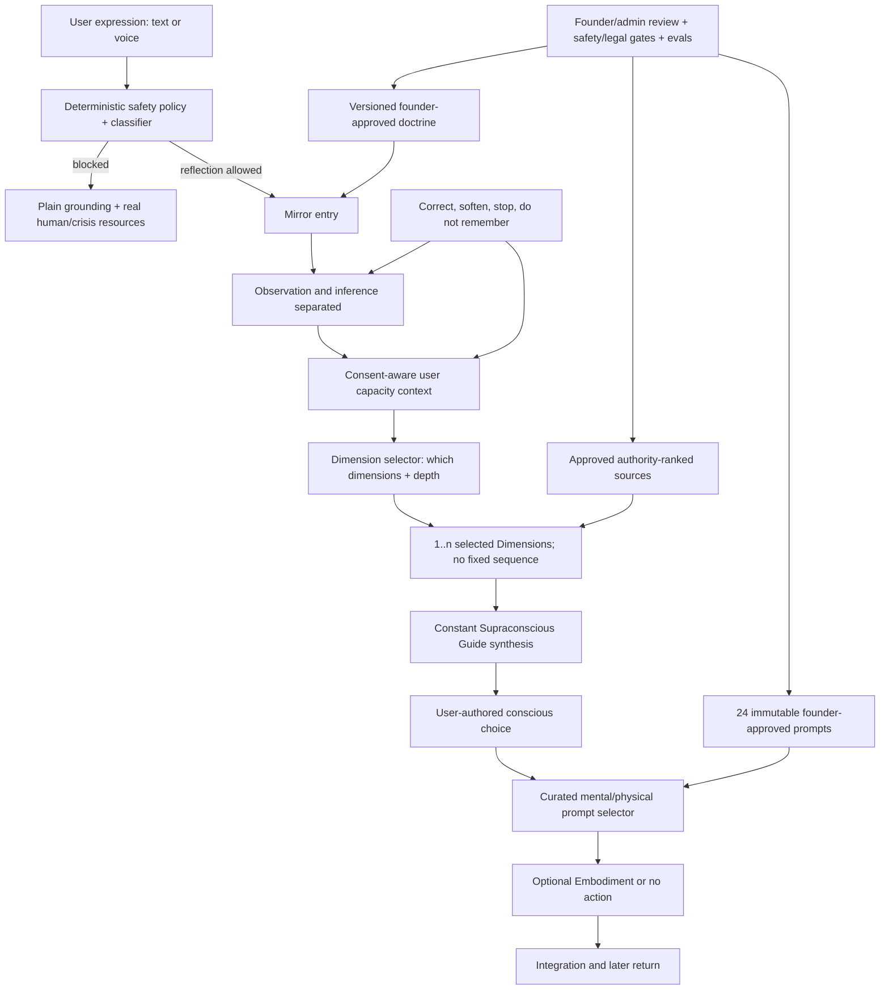

# Founder-Confirmed Seven Dimensions Parity Plan

## Status And Authority

- Planning artifact only; this document does not change product behavior.
- Reconciled on 2026-07-30 after receiving Maria's final context set, whose v3 brief describes July 31 confirmations.
- This plan supersedes the earlier four-role Inner Council and five-stage Guide plan.
- The prior plan is retained as `foundational-consciousness-architecture-parity-plan-v1-superseded.md`.

### Founder inputs, in precedence order

Later direct confirmations override conflicting earlier proposals.

1. Maria's **Founder Decision Brief v3**, incorporating her July 31 confirmations.
2. Maria's **Physical Prompts for SupraAI**, including ten founder-approved user-facing prompts.
3. Maria's **SupraAI Mental Prompt Library**, including fourteen founder-approved user-facing prompts.
4. Maria's earlier **Foundational Consciousness Architecture**, retained wherever it does not conflict with the later confirmations.

### Explicitly superseded assumptions

The following are no longer valid product requirements:

- Inner Council as the public or conceptual architecture;
- Protector, Conditioned Self, Visionary, and Truth Self as the runtime response structure;
- “lenses” or “parts” terminology for the core framework;
- Threshold as the session entry term;
- Revelation as an alternative entry term;
- Echo, Witness, Clear Mirror, Reframer, and Inner Author as Guide stages;
- progression framed as the AI or Guide becoming more advanced;
- fixed two-lens/four-lens Council selection;
- generic AI-generated experiential prompts as the v1 prompt library;
- direct “Maria teaches,” “Maria says,” or equivalent product attribution.

## Executive Verdict

The current app has strong reusable infrastructure, but its principal product model now conflicts with Maria's confirmed doctrine.

Reusable foundations include:

- authenticated private journaling and voice input;
- safety classification and high-risk grounding;
- structured AI outputs and evidence fields;
- one integrating question and embodiment capture;
- source ingestion, rights review, provenance, citations, and curated ontology;
- prompt versioning, quality review, founder calibration, and privacy-safe traces;
- opt-in pattern memory and data controls;
- web, mobile, admin, and MCP clients around a shared service boundary.

The central runtime, data model, terminology, progression UI, and tests are nevertheless built around the removed Inner Council and five-stage Guide concepts. Parity therefore requires an additive domain migration, not copy-only replacement.

The highest-priority changes are:

1. Replace the four-role Council with the Seven Dimensions of the Supraconscious:
   Perception, Story, Fear, Ego, Genius, Supraconscious, and Embodiment.
2. Replace Threshold with Mirror.
3. Remove the five Guide stages and represent progression as the user's increasing capacity to move from unconscious perception to embodied conscious choice.
4. Keep the Guide persona constant.
5. Vary which dimensions appear and how deeply they are explored per session.
6. Replace generic prompt generation in v1 with the 24 founder-supplied curated prompts.
7. Keep internal technique names and source annotations out of user-facing prompt text.
8. Enforce the absolute no-direct-Maria-attribution rule.
9. Require professional safety review and legal/privacy review before any broader pilot.
10. Keep the experience in founder-only testing until the P0 migration and release gates pass.

## Locked Doctrine

| Area | Founder-confirmed rule | Product consequence |
| --- | --- | --- |
| Core promise | Self-recognition: distinguishing fearful self from genius self | Fear and Genius must be distinct dimensions, not opposing diagnoses or fixed identities |
| Audience | Low-to-high confidence and consciousness; not gender-limited or remedial-only | Avoid deficit framing and gendered defaults |
| Category | Self-inquiry | Do not position as therapy, coaching, advice, or divination |
| Framework name | The Seven Dimensions of the Supraconscious | Use “dimensions,” never “lenses,” “levels,” or “parts of the psyche” |
| Dimensions | Perception, Story, Fear, Ego, Genius, Supraconscious, Embodiment | New structured domain model and response contract |
| Entry term | Mirror | Replace Threshold and reject Revelation |
| Observer | The unattached observer of the Story dimension | Observer is a stance/function, not an eighth dimension |
| Guide | Supraconscious Guide; persona remains constant | Remove Guide persona advancement |
| Inner Avatar | Valid Maria vocabulary | Retain, but do not conflate it with Guide stages |
| Session variation | Dimension count and depth vary with the user's capacity | No fixed seven-step response and no old two/four-role rule |
| Progression | User consciousness evolves from perception toward embodied choice | Replace stage-count ladder with evidence-based user-capacity signals |
| Embodiment | One of seven dimensions | Retire “Embodiment Gate” completion framing |
| Physical practice | Guide offers embodied action and physical awareness practice | Curated, safety-reviewed physical prompt selection |
| Voice pillar | “Life as performance,” in service of becoming more truthful and more oneself | Add performance/authenticity rubric and examples |
| Intensity | Calibrated to strengthen perception of self and world | Directness must serve perception, evidence, consent, and safety |
| Authority | Tentative language; no diagnosis or hidden-life knowledge | Evidence and epistemic status remain mandatory |
| Maria attribution | Never present guidance as “Maria teaches/says” or equivalent | Public response and prompt copy cannot claim her live voice or authority |
| Source-free output | General reflection is allowed when transparently labeled | Preserve explicit response modes |
| Memory | View, correct, disable, and delete are always available | Existing controls need rename, individual delete, and correction influence |
| Safety | Immediate exit into plain grounding and real crisis resources | Professional review is a pre-launch blocking gate |
| Privacy tone | Legal-sounding, not warm/casual | Rewrite consent/privacy copy with legal review |
| Brand direction | SupraAI | Do not complete global rename until final formal/public name relationship is decided |

## Seven Dimensions Contract

| Dimension | Founder question | Required distinction | Forbidden collapse |
| --- | --- | --- | --- |
| Perception | What am I noticing? | Concrete present noticing, sensations, facts, and frame | Do not treat interpretation as observation |
| Story | What meaning have I created? | User-created meaning viewed from the Observer stance | Do not call the remembered story objective truth |
| Fear | What am I protecting? | Anticipated loss, risk, and protective function | Do not equate fear with proof of danger |
| Ego | Which identity is responding? | Persona, role, control, performance, and learned identity | Do not shame or define the whole user |
| Genius | What higher possibility is available? | Existing possibility, creativity, truthfulness, and capacity | Do not flatter, promise manifestation, or imply spiritual superiority |
| Supraconscious | What conscious choice is now possible? | Agency, discernment, responsibility, and authorship | Do not choose for the user |
| Embodiment | How will I live that choice? | Voluntary action or physical awareness practice | Do not require action, intensity, or completion |

The dimensions are equal facets, not a hierarchy. The journey from Perception toward Embodiment describes a possible arc of growing awareness, not a score, rank, or mandatory sequence.

## Specialist Review Synthesis

The ten planning-review roles were applied as structured review lenses. They were not separate independent agent reviews.

| Review lens | Highest-priority conclusion |
| --- | --- |
| Product strategy | Founder-only testing should focus on Mirror → selected Dimensions → constant Guide → optional Embodiment, using only the approved prompt library. |
| Platform architecture | Preserve the shared service boundary, but introduce a versioned v2 response contract and additive compatibility layer. |
| AI architecture | Remove role orchestration; add dimension selection/depth, evidence-bound outputs, constant-Guide synthesis, and doctrine validators. |
| Content/CMS | Store public prompt text separately from internal technique/source provenance; founder approval and rights must be first-class. |
| Trust/privacy/rights | Professional safety and legal/privacy reviews block broader pilot. Public attribution and prompt IP rules need explicit enforcement. |
| Marketplace/monetization | Do not sell progression, consciousness, or “deeper” developmental status. Billing may govern access, not personal advancement. |
| UX/product design | Remove Council/stage metaphors, use Mirror and dimension-aware reflection, and keep correction, stop, non-action, and accessibility visible. |
| Data/analytics | Track selected dimensions and user-authored choice without scoring consciousness or rewarding emotional disclosure. |
| Docs/DevRel | Update architecture, APIs, glossary, localization, prompt-authoring rules, and deprecation guidance together. |
| Agile/TPM | Land doctrine/safety/data contracts before renaming screens; otherwise multiple clients will drift during migration. |

## Current-State Audit

### Terminology and architecture

| Current implementation | Founder-confirmed target | Status |
| --- | --- | --- |
| Inner Council in README, product copy, web, mobile, admin, docs, pricing, and MCP | Seven Dimensions | P0 mismatch |
| Four fixed `CouncilRole` values and four required messages | Variable dimension selection and depth | P0 mismatch |
| Threshold curriculum and UI labels | Mirror | P0 mismatch |
| Echo/Witness/Clear Mirror/Reframer/Inner Author | No Guide persona stages | P0 mismatch |
| Embodiment Gate / “Cross the Gate” | Embodiment dimension; action is optional | P0 mismatch |
| Generated symbolic prompt per session | Curated 24-prompt founder library for v1 | P0 mismatch |
| “Inspired by Maria…” in public/session copy | No direct Maria attribution in guidance | P0 mismatch |
| Guide becoming/deepening UI | Constant Guide; user perception changes | P0 mismatch |

### Runtime and schema evidence

The current code hard-codes the superseded model in:

- `packages/ai/src/council-roles.ts`;
- `packages/ai/src/generate-council-run.ts`;
- `packages/ai/src/council-pilot-validator.ts`;
- `packages/ai/src/council-reflection-service.ts`;
- `packages/ai/src/guide-stage-config.ts`;
- `packages/ai/src/progression.ts`;
- `packages/ai/src/generate-symbolic-prompt.ts`;
- `packages/db/prisma/schema.prisma`;
- web and mobile response components;
- mobile localization catalogs and tests;
- ChatGPT/MCP tool names and response schemas;
- admin Council, Guide Stage, prompt, and calibration pages;
- repository documentation and launch runbooks.

Existing persistent concepts that require compatibility treatment include:

- `User.currentLevel`;
- `User.avatarStage`;
- `AvatarStageConfig`;
- `CouncilSession`;
- `CouncilMessage`;
- `CouncilSynthesis`;
- `GeneratedPrompt`;
- `EmbodimentGateResponse`;
- `CurriculumDay` and Threshold presentation;
- `SourceChunk.councilRoleTags`;
- Council-named feature flags, traces, events, admin routes, and MCP tools.

Historical records must remain readable. Existing tables and APIs must not be destructively renamed in one migration.

### Analysis and user agency

The earlier audit findings remain valid where v3 did not override them:

- observation and inference are not typed separately enough;
- first-session pattern inference can appear as memory despite recurrence copy;
- saved “not accurate” feedback does not yet influence later generation;
- tone and intensity are displayed but not editable in the primary web form;
- users cannot rename or individually delete pattern memories;
- conscious choice is not stored as a distinct user-authored record;
- Embodiment is framed as completion;
- source authority lacks edition, supersession, and conflict resolution;
- anti-dependency/self-authorship is not yet a measurable outcome.

## Founder Prompt Libraries

### V1 inventory

Maria supplied 24 curated prompts:

- 10 physical/acting-derived prompts;
- 14 mental prompts, two for each dimension.

The library is sufficient for v1. Do not supplement it with generic wellness, meditation, gratitude, mood-rating, control-list, or generic AI-journaling prompts.

### Physical prompt inventory

| Stable internal key | Internal technique reference | Dimension tags | Public prompt title/internal label |
| --- | --- | --- | --- |
| `physical.release_into_body` | Strasberg relaxation | Embodiment | Release into the Body |
| `physical.sensory_anchor` | Sense memory | Perception | Sensory Anchor |
| `physical.inner_map_return` | Affective memory | Story | The Inner Map Return |
| `physical.act_as_if` | Magic If | Genius, Supraconscious | Act “As If” |
| `physical.enter_frame` | Given circumstances | Perception, Story | Enter the Frame |
| `physical.borrow_future_self` | Substitution | Genius | Borrow the Future Self |
| `physical.unwitnessed_truth` | Private moment | Ego | The Unwitnessed Truth |
| `physical.name_it_twice` | Meisner repetition | Ego | Name It Twice |
| `physical.one_gesture` | Chekhov psychological gesture | Embodiment | The One Gesture |
| `physical.narrow_frame` | Circle of attention | Perception | Narrow the Frame |

### Mental prompt inventory

| Stable internal key | Internal source exercise | Dimension |
| --- | --- | --- |
| `mental.perception_projection` | Nature Exercise | Perception |
| `mental.perception_wholeness` | Wholeness Check-in | Perception |
| `mental.story_identity_without_labels` | ID Exercise | Story |
| `mental.story_braver_question` | Ask the Right Questions | Story |
| `mental.fear_unspoken_truth` | Secret Rule Questions | Fear |
| `mental.fear_language_shift` | Micro-Mindset Shifts | Fear |
| `mental.ego_persona` | Ego Exercise | Ego |
| `mental.ego_repeated_voice` | Awareness Mapping | Ego |
| `mental.genius_golden_sphere` | Golden-ball visualization | Genius |
| `mental.genius_already_present` | 365 Daily Frames of Thought | Genius |
| `mental.supraconscious_observer` | Observer Meditation | Supraconscious |
| `mental.supraconscious_inner_dialogue` | Masculine/feminine inner dialogue | Supraconscious |
| `mental.embodiment_wholeness_breath` | Wholeness breathing meditation | Embodiment |
| `mental.embodiment_resilient_listening` | Moment-to-Moment Resilient Listening | Embodiment |

### Public/private content boundary

Each prompt record must separate:

#### Internal-only fields

- original acting technique or named book exercise;
- source work and locator;
- Maria-source rationale;
- internal excerpts or quotations;
- rights and review records;
- contraindications and reviewer notes;
- selection rationale and eval metadata.

#### User-visible fields

- only Maria-approved prompt title, prompt text, and separately approved product-level safety/accessibility copy;
- optional dimension name if Maria confirms it may be displayed;
- neutral duration/preparation metadata only if founder-approved.

The system must never expose the classic technique name, adaptation explanation, unpublished notes, internal source rationale, or internal quotations merely because they are stored with the prompt.

### Prompt immutability rule

For founder-only v1 testing:

- select from the approved library;
- do not ask the model to rewrite, remix, intensify, soften, translate, or combine public prompt text;
- do not generate a “similar” prompt automatically;
- version any founder-approved text change as a new prompt revision;
- keep assignment/selection logic separate from immutable prompt content.

“Code similar” is interpreted as permission to build a reusable structured prompt component and selection system, not permission to fabricate similar user-facing wording.

## Safety And Accessibility Review Of Prompt Libraries

Maria's text is canonical, but selection still requires safety policy.

Prompts needing explicit review include:

- affective-memory and inner-map prompts that may activate trauma;
- observer imagery that may be unsuitable during dissociation, paranoia, or destabilization;
- future-self wording that could be misread as prediction or hidden certainty;
- golden-light visualization that must not become spiritual-authority language;
- breath timing and repeated long exhalation;
- whole-body gesture, walking, sitting, closing eyes, and touch instructions;
- interpersonal listening practice that depends on context and safety.

Required controls:

- safety classification before prompt selection;
- mobility, respiratory, sensory, trauma, and environment-aware contraindication metadata;
- a non-physical alternative only when Maria approves its exact wording;
- skip/decline with no penalty;
- no physical prompt during a blocked safety flow;
- no auto-played voice instruction for destabilizing or high-risk states;
- professional review of crisis, dissociation, physical, and breath-practice language before broader pilot.

Open founder/legal question: Maria says the supplied prompt text is the only language a user should see. The team needs explicit approval for any product-level safety, accessibility, timing, opt-out, localization, or source-attribution text shown alongside it.

## Target Architecture

## Target Data Model

Use additive models first. Legacy Council and stage records remain available for historical sessions.

### `ReflectionSession`

- user and journal ownership;
- doctrine version;
- response mode;
- Mirror input/entry reference;
- safety snapshot;
- progression-profile version;
- selected prompt revision;
- created/completed/grounded status.

### `DimensionReflection`

- one of seven dimension keys;
- display order;
- depth;
- observation text;
- tentative interpretation text;
- evidence spans;
- confidence and epistemic status;
- abstention and reason;
- selected source chunk ids.

### `GuideSynthesis`

- constant Guide name/version;
- synthesis statement;
- exactly one Socratic question;
- optional embodiment invitation;
- source ids and validation status.

### `ReflectionCapacityProfile`

This is not a consciousness score.

- evidence of noticing;
- Story/fact distinction;
- user-recognized Fear/protection;
- Ego/persona awareness;
- user-authored Genius possibility;
- conscious-choice evidence;
- user-reported Embodiment;
- preferred directness and paused/simplified state;
- rubric version and last user correction.

The profile controls possible dimension depth and selection context. It must not display a rank or imply superiority.

### `CuratedPrompt`

- stable key;
- library type: mental, physical, or hybrid;
- dimension tags;
- immutable public title/text revision;
- internal technique/exercise name;
- source work and locator;
- rights state;
- founder approval state and approver;
- safety intensity;
- contraindication metadata;
- language and translation status;
- active/superseded state.

### `CuratedPromptAssignment`

- reflection session;
- prompt revision;
- selection reason code;
- selected dimensions;
- safety decision;
- accepted, skipped, completed, or declined state;
- user response where applicable.

### Compatibility mapping

| Legacy concept | V2 concept | Migration rule |
| --- | --- | --- |
| `CouncilSession` | `ReflectionSession` | Read legacy in place; new sessions use v2 model |
| `CouncilMessage` | `DimensionReflection` | Do not recast old role output as a dimension |
| `CouncilSynthesis` | `GuideSynthesis` | Preserve old output/version unchanged |
| `GeneratedPrompt` | `CuratedPromptAssignment` | Old generated prompts remain historical only |
| `EmbodimentGateResponse` | Embodiment response/assignment outcome | Preserve text; remove gate semantics for new UI |
| `AvatarStageConfig` | No direct replacement | Freeze and retire after compatibility period |
| `User.currentLevel/avatarStage` | `ReflectionCapacityProfile` | Do not translate numeric stage into consciousness state |
| Threshold curriculum | Mirror content | Migrate only founder-approved content; do not blind rename |
| `councilRoleTags` | `dimensionTags` | Add new field; manually curate mappings |

## Open Decisions

Only decisions still unresolved after Maria's final materials remain here.

1. Is SupraAI the final public name/domain, while Supraconscious Avatar AI remains formal/legal, or does SupraAI replace it everywhere?
2. What are 2–3 “too harsh,” “too soft,” and “just right” worked examples?
3. Which manuscripts, workshop notes, and transcripts beyond published books are cleared?
4. Is the broader launch cohort general public, Maria's audience, or a curated beta?
5. What is the exact one-sentence after-one-session promise?
6. What 3–5 sentences establish the approved voice reference?
7. What rule should select dimensions first/deeper for new versus returning users?
8. May public source citations name Maria as a book author when rights require attribution, or must all public citations omit her name under the no-attribution rule?
9. May product-level safety, accessibility, opt-out, duration, and localization copy appear alongside the exact prompt text?
10. Who are the named professional safety reviewer and legal/privacy reviewer, and what artifacts constitute sign-off?

## Workstreams And Jira-Ready Tickets

### Phase 0 — Canonical doctrine and founder gates

#### FCA-001 — Register the complete founder context set

- **Priority:** P0
- **Owner:** Product/content operations
- **Accountable:** Maria
- **Work:**
  - store all four inputs as separate versioned doctrine/library sources;
  - record precedence and explicit supersessions;
  - keep imports non-retrievable until rights and approval are recorded;
  - preserve checksums and supplied dates.
- **Acceptance criteria:**
  - each source has a version, checksum, rights state, founder approval state, and intended use;
  - v3 conflicts override earlier Council/stage/Threshold rules;
  - no imported prompt becomes public automatically;
  - all approvals and revisions are audited.

#### FCA-002 — Close the remaining ten decisions

- **Priority:** P0
- **Owner:** Carl
- **Accountable:** Maria for product doctrine; named reviewers for safety/legal
- **Acceptance criteria:**
  - each answer has owner, decision, rationale, and date;
  - naming does not block internal schema work;
  - safety/accessibility and public attribution decisions block prompt release;
  - dimension-selection rule blocks automated returning-user progression.

#### FCA-003 — Publish a versioned terminology and doctrine contract

- **Priority:** P0
- **Owner:** AI/platform engineering
- **Dependencies:** FCA-001
- **Contract includes:**
  - seven dimension keys and definitions;
  - Mirror and Observer semantics;
  - constant Guide rule;
  - removed terms;
  - no-Maria-attribution rule;
  - source modes;
  - prompt immutability;
  - safety and agency rules;
  - doctrine version in every trace.
- **Acceptance criteria:**
  - all new public responses identify the contract version internally;
  - removed terms fail new-copy validation;
  - historical payloads remain renderable;
  - contract changes require reason-gated founder approval.

### Phase 1 — Safety, rights, and quality gates

#### FCA-010 — Complete professional safety review

- **Priority:** P0
- **Owner:** Safety engineering/product
- **Accountable:** Named qualified reviewer
- **Scope:**
  - crisis/self-harm/harm-to-others;
  - dissociation, paranoia, hallucinations, delusional certainty, grandiosity;
  - abuse and immediate danger;
  - affective memory, observer visualization, future-self, breath, movement, touch, and closed-eye practices.
- **Acceptance criteria:**
  - reviewer findings and approved language are documented;
  - deterministic routing blocks unsafe dimension/prompt selection;
  - local fallback matches production safety policy;
  - no broader pilot until written sign-off.

#### FCA-011 — Complete legal/privacy/IP review

- **Priority:** P0
- **Owner:** Product/security/data
- **Accountable:** Named legal/privacy reviewer
- **Scope:**
  - raw-entry access and admin visibility;
  - consent, audit, retention, deletion, export, and anonymized-data use;
  - legal-sounding public privacy language;
  - published-book rights and unpublished-source clearance;
  - internal technique names versus public prompt text;
  - required attribution versus no-direct-Maria-attribution.
- **Acceptance criteria:**
  - approved privacy/consent copy is versioned;
  - prompt and source rights are recorded per intended use;
  - public/private source fields are enforced;
  - no broader pilot until written sign-off.

#### FCA-012 — Replace Council evals with the founder rubric

- **Priority:** P0
- **Owner:** AI quality engineering
- **Accountable:** Maria
- **Rubric axes:**
  - dimension distinction;
  - emotional accuracy;
  - grounding;
  - usefulness;
  - source fidelity;
  - agency;
  - intensity calibration;
  - performance/authenticity.
- **Fixtures include:**
  - all seven dimensions;
  - single- and multi-dimension sessions;
  - new versus returning-user selection;
  - source-grounded and source-free cases;
  - exact curated prompt selection;
  - no-attribution tests;
  - too-soft/too-harsh cases once supplied;
  - crisis and physical-practice contraindications.
- **Acceptance criteria:**
  - P0 safety, attribution, agency, and source failures block completion;
  - Maria approves golden examples;
  - model, prompt, doctrine, selector, and validator versions are stored;
  - old four-role validator is not used for v2 sessions.

### Phase 2 — Seven Dimensions domain migration

#### FCA-020 — Add v2 reflection persistence

- **Priority:** P0
- **Owner:** Data/platform engineering
- **Dependencies:** FCA-003
- **Work:**
  - add `ReflectionSession`, `DimensionReflection`, `GuideSynthesis`, and capacity-profile models;
  - add dimension tags without removing Council tags;
  - add v2 trace/event types;
  - implement owner-scoped reads, exports, deletion, and audit behavior.
- **Acceptance criteria:**
  - additive migration applies cleanly;
  - no legacy data is rewritten or interpreted as dimensions;
  - account export/deletion covers v1 and v2;
  - raw journal privacy defaults are unchanged.

#### FCA-021 — Implement Mirror and layered analysis

- **Priority:** P0
- **Owner:** AI engineering
- **Dependencies:** FCA-020
- **Work:**
  - replace Threshold entry semantics for new sessions;
  - separate textual observation, user report, Story meaning, and tentative inference;
  - retain evidence spans and confidence;
  - keep the Observer attached to Story, not as an extra dimension.
- **Acceptance criteria:**
  - UI distinguishes what was written from one possible reading;
  - no inference appears as fact;
  - “Mirror” is used in all v2 entry points;
  - unsupported inference produces abstention or inquiry.

#### FCA-022 — Build dimension selection and depth policy

- **Priority:** P0
- **Owner:** AI/product engineering
- **Accountable:** Maria
- **Dependencies:** FCA-002 decision 7, FCA-021
- **Work:**
  - return selected dimensions, order, depth, evidence, and reason codes;
  - vary dimensions by present entry, user capacity, correction history, safety, and consent;
  - do not always run all seven;
  - do not treat dimensions as levels or force Perception→Embodiment every session.
- **Acceptance criteria:**
  - selection matches founder golden fixtures;
  - no dimension is selected only because of emotional intensity;
  - selection rationale is auditable and non-diagnostic;
  - user can request simpler/gentler handling;
  - returning-user context is disabled until memory/correction controls are ready.

#### FCA-023 — Implement seven evidence-bound dimension generators

- **Priority:** P0
- **Owner:** AI engineering
- **Dependencies:** FCA-022
- **Acceptance criteria:**
  - each dimension genuinely differs under Maria's rubric;
  - every interpretation is tentative and evidence-backed;
  - Fear recognizes protection without proving danger;
  - Ego reveals persona without shaming;
  - Genius does not flatter or promise;
  - Supraconscious returns choice to the user;
  - Embodiment remains voluntary.

#### FCA-024 — Implement the constant Supraconscious Guide

- **Priority:** P0
- **Owner:** AI/product engineering
- **Dependencies:** FCA-023
- **Work:**
  - synthesize selected dimensions;
  - retain one Socratic question;
  - offer an optional curated prompt/physical practice;
  - remove stage/persona behavior from generation.
- **Acceptance criteria:**
  - Guide identity and base behavior remain constant;
  - no “Guide deepened/advanced/became” output;
  - synthesis does not mechanically recap every dimension;
  - user authors the conscious choice.

#### FCA-025 — Seed the immutable curated prompt library

- **Priority:** P0
- **Owner:** Content/data engineering
- **Accountable:** Maria
- **Dependencies:** FCA-001, FCA-010, FCA-011
- **Work:**
  - create 24 stable prompt records;
  - preserve public text exactly;
  - store internal source/technique provenance separately;
  - record safety, rights, language, founder approval, and revision state.
- **Acceptance criteria:**
  - 10 physical and 14 mental prompts exist;
  - automated checksum tests detect public-text drift;
  - internal technique/source fields never serialize publicly;
  - no generic fallback prompt is active;
  - unapproved translations are unavailable.

#### FCA-026 — Build curated prompt selection

- **Priority:** P0
- **Owner:** AI/platform engineering
- **Dependencies:** FCA-022, FCA-025
- **Work:**
  - select an eligible prompt by dimensions, safety, modality, prior use, user preference, and contraindications;
  - return no prompt when none is appropriate;
  - store assignment and reason;
  - never rewrite prompt text.
- **Acceptance criteria:**
  - selection cannot bypass safety/rights/founder approval;
  - prompt is byte-for-byte the approved revision;
  - user may skip or decline;
  - no prompt is treated as a required session conclusion;
  - repeated selection behavior is explainable.

#### FCA-027 — Retire generic prompt generation for v2

- **Priority:** P0
- **Owner:** AI/platform engineering
- **Dependencies:** FCA-025, FCA-026
- **Work:**
  - stop calling `generateSymbolicPrompt()` for v2 sessions;
  - deprecate public generic prompt endpoints and MCP helpers;
  - keep v1 historical render support.
- **Acceptance criteria:**
  - no v2 route fabricates prompt wording;
  - compatibility callers receive a versioned deprecation response or curated assignment;
  - old saved prompts remain viewable;
  - docs state that v1 uses the founder-curated library only.

### Phase 3 — User agency, progression, and embodiment

#### FCA-030 — Add in-session agency controls

- **Priority:** P0
- **Owner:** Web/mobile product engineering
- **Controls:**
  - does not fit;
  - misunderstood me;
  - gentler;
  - more direct when safe;
  - do not explore;
  - stop;
  - do not remember this session;
  - skip physical practice.
- **Acceptance criteria:**
  - corrections affect the next relevant output;
  - stop prevents continuation;
  - directness never overrides safety;
  - correction is never reframed as defensiveness;
  - web and mobile behave consistently.

#### FCA-031 — Replace stages with capacity-aware progression

- **Priority:** P0
- **Owner:** Product/AI/data engineering
- **Accountable:** Maria
- **Dependencies:** FCA-022, FCA-030
- **Work:**
  - freeze numeric stage advancement for v2;
  - remove stage names, completion badges, and Guide-level-up moments;
  - use evidence of the user's own noticing, Story distinction, protection awareness, persona recognition, possibility, choice, and embodiment;
  - never expose a consciousness score.
- **Acceptance criteria:**
  - time, count, payment, and emotional intensity cannot create progression;
  - Guide remains constant;
  - user can pause or simplify;
  - capacity context changes selection/depth only through the approved rule;
  - pricing does not market consciousness progression.

#### FCA-032 — Complete preference and memory controls

- **Priority:** P0
- **Owner:** Web/mobile/data engineering
- **Work:**
  - make tone/intensity editable;
  - add topics-to-avoid and physical-practice preference;
  - add rename and individual delete for memory;
  - make inaccurate/too-intense feedback affect future use;
  - explain memory influence.
- **Acceptance criteria:**
  - memory remains default-off;
  - disabling memory stops reads and writes;
  - corrected/deleted memories do not reappear silently;
  - first-session inference is not presented as recurring truth;
  - all controls are owner-scoped.

#### FCA-033 — Reframe Embodiment as a dimension

- **Priority:** P0
- **Owner:** Product/web/mobile
- **Dependencies:** FCA-024, FCA-025
- **Work:**
  - remove Gate/crossed/completion language;
  - allow act, observe, rest, wait, decline, or uncertainty;
  - present curated physical practice only when eligible;
  - add accessibility and safety affordances after founder approval.
- **Acceptance criteria:**
  - no action is a valid outcome;
  - skipping does not reduce progress;
  - prompt text is immutable;
  - physical practice is never selected on a blocked safety flow;
  - user-authored choice remains distinct from suggested practice.

### Phase 4 — Source, admin, localization, and public copy

#### FCA-040 — Add source authority and conflict governance

- **Priority:** P0
- **Owner:** Data/admin engineering
- **Accountable:** Maria
- **Work:**
  - authority tier, edition, effective date, approval, supersession, and conflict status;
  - published works as safest tier;
  - unpublished sources unapproved until explicitly cleared;
  - founder-owned substantive conflict resolution.
- **Acceptance criteria:**
  - retrieval deterministically prefers current approved authority;
  - unresolved conflicts cannot produce a source-grounded claim;
  - historical traces retain their original source versions;
  - no file self-declares founder approval.

#### FCA-041 — Enforce public attribution and content boundaries

- **Priority:** P0
- **Owner:** Platform/content engineering
- **Dependencies:** FCA-002 decision 8, FCA-011
- **Work:**
  - block “Maria teaches/says/tells us” and equivalents;
  - remove public copy implying the Guide speaks for her;
  - preserve legally required source metadata only in the approved format;
  - keep internal prompt provenance private.
- **Acceptance criteria:**
  - validators cover supported languages;
  - public APIs cannot serialize internal technique/source notes;
  - source-free output is transparently labeled;
  - attribution-policy violations block release.

#### FCA-042 — Replace public terminology across all clients

- **Priority:** P0
- **Owner:** Web/mobile/admin/docs engineering
- **Dependencies:** FCA-003, FCA-020
- **Scope:**
  - navigation, landing, journal, saved sessions, patterns, pricing, Guide;
  - admin review and calibration;
  - web/mobile localization;
  - voice playback;
  - MCP names/descriptions;
  - docs, runbooks, README, and architecture diagrams.
- **Acceptance criteria:**
  - no new public copy uses Inner Council, Threshold, old stage names, or Embodiment Gate;
  - compatibility names are explicitly marked internal/legacy;
  - localization catalogs pass removed-term scans;
  - product naming waits for decision 1.

#### FCA-043 — Build prompt-library admin governance

- **Priority:** P0
- **Owner:** Admin/content engineering
- **Dependencies:** FCA-025
- **Work:**
  - separate public text from internal provenance;
  - reason-gated founder approval and supersession;
  - rights, safety, contraindication, dimension, and translation review;
  - preview exactly what public clients receive.
- **Acceptance criteria:**
  - ordinary admins cannot silently edit approved public text;
  - revisions create versions;
  - public preview excludes internal-only fields;
  - audit log records reason, actor, old/new checksum, and approval.

#### FCA-044 — Localize only through founder-approved revisions

- **Priority:** P1 for founder-only English; P0 before localized pilot
- **Owner:** Localization/content
- **Accountable:** Maria or delegated linguistic reviewer
- **Acceptance criteria:**
  - machine translation cannot publish prompt text automatically;
  - each locale has independent approval/checksum;
  - missing translation falls back only according to approved policy;
  - no locale reintroduces Council/stage/Threshold terminology or direct attribution.

### Phase 5 — Cross-surface rollout

#### FCA-050 — Introduce a versioned v2 reflection API

- **Priority:** P0
- **Owner:** Platform engineering
- **Dependencies:** FCA-020 through FCA-027
- **Work:**
  - one service for web, mobile, voice, and MCP;
  - return Mirror, selected dimensions, Guide synthesis, curated prompt, provenance, and capacity-safe metadata;
  - keep v1 adapter for saved historical sessions.
- **Acceptance criteria:**
  - all public entry points share safety, selection, validation, and persistence;
  - no lower-level tool bypasses policy;
  - schema version is explicit;
  - raw journal text remains excluded from public response metadata and external traces.

#### FCA-051 — Migrate web and mobile experience

- **Priority:** P0
- **Owner:** Web/mobile engineering
- **Dependencies:** FCA-050
- **Flow:**
  - Mirror;
  - expression;
  - observation/Story distinction;
  - selected Dimensions;
  - constant Guide;
  - user-authored choice;
  - optional curated mental or physical prompt;
  - later return.
- **Acceptance criteria:**
  - dimension count may vary without broken layout;
  - no stage orb or level-up moment remains in v2;
  - correction, stop, skip, and safety states are complete;
  - mobile and web expose equivalent material agency controls.

#### FCA-052 — Migrate admin review and calibration

- **Priority:** P0
- **Owner:** Admin/AI quality engineering
- **Dependencies:** FCA-012, FCA-050
- **Review fields:**
  - doctrine/API version;
  - selected dimensions and depth;
  - selection reasons;
  - Guide constancy;
  - prompt revision/checksum;
  - source mode and citations;
  - safety and contraindication decision;
  - memory influence;
  - founder rubric labels.
- **Acceptance criteria:**
  - metadata-first review remains default;
  - raw reveal remains reason-gated and audited;
  - P0 failures block founder-test promotion;
  - rollback preserves historical output.

#### FCA-053 — Run founder-only parity testing

- **Priority:** P0
- **Owner:** Product/TPM
- **Accountable:** Carl and Maria
- **Dependencies:** all founder-test P0 tickets
- **Acceptance criteria:**
  - Carl and Maria can run the same curated scenarios;
  - all seven dimensions appear across the test set without being forced every session;
  - all 24 prompts are previewed and safety-reviewed;
  - no direct attribution, generic prompt, stage, Council, or Threshold language appears;
  - correction and no-memory behavior are verified;
  - founder issues are triaged against the eight-axis rubric.

#### FCA-054 — Gate broader pilot

- **Priority:** P0
- **Owner:** Product/TPM
- **Dependencies:** FCA-010, FCA-011, FCA-053
- **Blocking requirements:**
  - final brand relationship;
  - confrontation examples and calibration thresholds;
  - professional safety sign-off;
  - legal/privacy/IP sign-off;
  - named launch cohort;
  - source clearance;
  - rollback rehearsal.
- **Acceptance criteria:**
  - no open P0 safety, agency, attribution, rights, privacy, or doctrine issue;
  - written Carl/Maria approval;
  - written professional reviewer approvals;
  - cohort and support path are documented.

## Recommended Delivery Sequence

1. **Canonical inputs and decisions:** FCA-001 through FCA-003.
2. **Blocking reviews and rubric:** FCA-010 through FCA-012.
3. **Additive v2 domain:** FCA-020 and FCA-021.
4. **Dimension engine and Guide:** FCA-022 through FCA-024.
5. **Curated prompt library:** FCA-025 through FCA-027.
6. **Agency, progression, and Embodiment:** FCA-030 through FCA-033.
7. **Source, attribution, admin, and localization:** FCA-040 through FCA-044.
8. **Cross-surface founder test:** FCA-050 through FCA-053.
9. **Broader pilot only after gates:** FCA-054.

Do not begin with global terminology replacement. First add the v2 contract and persistence boundary so web, mobile, admin, and MCP can migrate without corrupting historical sessions or temporarily mixing models.

## Release Slices

### Slice A — Planning and non-public foundations

- source registration;
- decisions;
- doctrine contract;
- professional review setup;
- v2 schema;
- prompt seed tooling.

No public behavior change.

### Slice B — Feature-flagged founder preview

- Mirror;
- Seven Dimensions;
- constant Guide;
- curated prompt library;
- founder-only admin review.

Feature flag remains limited to Carl and Maria.

### Slice C — Founder calibration completion

- progression/capacity context;
- agency/memory corrections;
- web/mobile parity;
- all gold-standard rubric fixtures.

### Slice D — Broader pilot

Only after legal, privacy, safety, naming, source, and cohort gates pass.

## RACI

| Area | Responsible | Accountable | Consulted | Informed |
| --- | --- | --- | --- | --- |
| Doctrine, dimensions, voice, and prompt text | AI/content engineering | Maria | Carl | Delivery team |
| Product scope and UX | Product/design/engineering | Carl | Maria, founder testers | Delivery team |
| Safety policy and physical practices | AI/safety engineering | Named professional reviewer | Carl, Maria | Founder testers |
| Privacy, consent, retention, and IP | Product/security/data | Named legal/privacy reviewer | Carl, Maria | Delivery team |
| Source approval and conflicts | Admin/data engineering | Maria | Rights/legal reviewer | Delivery team |
| Architecture and compatibility migration | Platform engineering | Carl | Web, mobile, admin, AI engineers | Delivery team |
| Eval and founder-test gate | AI quality engineering | Carl and Maria | Safety/legal reviewers | Delivery team |

## Risk Register

| Risk | Impact | Likelihood | Mitigation | Owner | Gate |
| --- | --- | --- | --- | --- | --- |
| Global rename corrupts historical data or breaks clients | High | High | Add v2 models/API and compatibility adapter first | Platform lead | Before public copy migration |
| “Dimensions” become a disguised hierarchy | High | Medium | Contract, UX review, no score, variable selection | Product/AI lead | Before founder preview |
| Guide stages persist through artwork or copy | High | High | Removed-term scans, retire stage config and orb UI | Web/mobile lead | Before founder preview |
| Model rewrites founder prompt text | High | High | Immutable revisions and checksum tests | Content/platform lead | Before prompt activation |
| Internal acting/source notes leak publicly | High | Medium | Separate public/internal projections and API tests | Platform/security lead | Before prompt activation |
| Physical or memory prompts destabilize users | High | Medium | Contraindications, deterministic safety route, professional review | Safety lead | Before broader pilot |
| No-attribution rule conflicts with legal attribution | High | Medium | Founder/legal decision 8 and approved citation format | Legal/content lead | Before source-grounded release |
| Translations alter Maria's meaning | High | High | Human founder-approved locale revisions only | Localization lead | Before localized pilot |
| Progression still ranks consciousness indirectly | High | High | No scores/stages; selection context only; founder rubric | Product lead | Before progression activation |
| Generic fallback prompts reappear through legacy tools | High | High | Deprecate/wrap endpoints; cross-entry contract tests | Platform lead | Before founder preview |
| Privacy copy remains warm/ambiguous rather than legal | High | Medium | Legal-authored versioned copy and review | Legal/product lead | Before broader pilot |
| Founder-only feature leaks to general users | High | Low | cohort/feature-flag tests and fail-closed defaults | Platform lead | Every founder release |

## Success Metrics

Metrics must not reward intensity, disclosure volume, time in app, session count, or dependency.

### Doctrine and content fidelity

- 100% of v2 sessions use the current doctrine contract.
- 100% of user-visible curated prompts match an approved checksum.
- Zero public serialization of internal technique/source notes.
- Zero direct-Maria-attribution violations.
- Zero removed-term violations in new public copy.

### Reflection quality

- Founder agreement on dimension selection and distinction.
- Emotional accuracy against user evidence.
- Constant-Guide behavior across capacity contexts.
- Correct source-grounded/general response labeling.
- Performance/authenticity rubric rating.

### Agency and safety

- 100% availability of correct, soften, stop, no-memory, and skip controls.
- Zero blocked-safety flows entering dimension or prompt generation.
- Physical-practice selection obeys all contraindications.
- User-authored choice is never synthesized on the user's behalf.

### Self-authorship

- User-authored observation, choice, and follow-up signals increase without treating them as a score.
- Users can decline Embodiment without penalty.
- No product KPI defines success as more sessions or “higher consciousness.”

## Verification Matrix

| Layer | Required verification |
| --- | --- |
| Doctrine | precedence, versioning, removed-term rules, founder approval audit |
| Schema | additive migration, Prisma validation/generation, legacy and v2 reads, export/deletion |
| AI | dimension schemas, selection/depth, evidence, Guide constancy, no-attribution validator |
| Prompt library | 24 records, exact-text checksums, rights, safety, no public internal fields |
| Safety | crisis/dissociation/paranoia/abuse fixtures, physical contraindications, local fallback parity |
| Sources | authority, supersession, conflict block, attribution projection |
| Web | v1 historical render, v2 Mirror/Dimensions flow, agency, no stages/Gate |
| Mobile | variable dimension layout, curated prompts, preferences, agency, builds |
| MCP | v2 schema, legacy deprecation, no generic prompt bypass |
| Admin | founder approval, prompt versioning, rubric review, raw reveal audit |
| Localization | founder approval per locale, removed-term scan, checksum/version |
| Privacy | legal copy, data minimization, owner scope, retention/deletion |
| Release | founder cohort flag, written safety/legal approvals, rollback rehearsal |

## Definition Of Founder-Only Parity

Founder-only parity is achieved when:

1. The v3 brief and both prompt libraries are registered and founder-approved.
2. New sessions use Mirror and the Seven Dimensions contract.
3. No new session uses four Council roles or five Guide stages.
4. The Guide persona remains constant.
5. Dimension selection and depth vary under an approved, auditable policy.
6. The v1 library contains exactly 10 physical and 14 mental approved prompts.
7. Prompt text is immutable and internal provenance never reaches public clients.
8. Direct Maria attribution is blocked.
9. Observation, inference, user choice, and Embodiment are distinct.
10. Memory and correction controls work end-to-end.
11. High-risk flows bypass reflection and prompt selection.
12. Web, mobile, admin, and MCP use or correctly adapt to the versioned v2 contract.

## Definition Of Broader-Pilot Readiness

Broader pilot readiness additionally requires:

1. final public/formal brand relationship;
2. approved harsh/soft/just-right examples;
3. named cohort and after-one-session promise;
4. cleared source inventory;
5. written professional safety approval;
6. written legal/privacy/IP approval;
7. founder-approved public attribution and safety/accessibility policy;
8. founder calibration with no open P0 issues;
9. tested rollback and support procedure.

## Immediate Next Step

The next bounded increment is planning and governance, not UI renaming:

1. complete FCA-001 by registering the final founder context set;
2. obtain answers and named reviewers for FCA-002;
3. implement the terminology/doctrine contract in FCA-003;
4. design the additive v2 schema and prompt-library seed manifest;
5. begin professional safety and legal/privacy reviews in parallel.

Only after those gates should implementation switch the founder-only runtime from Council/stages/generic prompts to Mirror/Seven Dimensions/curated prompts.
